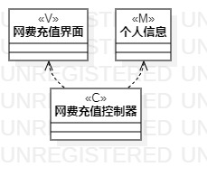
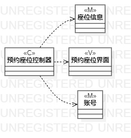

# 实验四&五 类建模 & 高级建模

## 一、实验目标

### 1.掌握类建模概念；
### 2.掌握MVC的概念；
### 3.学会画类图。

## 二、实验内容

### 1. 使用ClassDiagram类画类图；
### 2. 将与类图相关的模型、界面、控制器画出。

## 三、实验步骤

### 1. 创建ClassDiagram;
### 2. 画出Model类、View类、Controller类;
### 3. 将相关的各类准确地连起来;
### 4. 排版。

## 四、实验结果

图1：网费充值类图

图2：座位预约类图

## 五、实验笔记

### 1. 类描述了两个方面：状态和行为（属性与操作）；
### 2. 类在UML的表示：矩形=名称+属性+操作；
### 3. UML四种可见性符号：Public（+）、Protected（#）、Package（~）、Private（-）；
### 4. 类关系连接注意事项：尽量选择弱的连接（如Dependency）、尽量不用inheritance；
### 5. MVC：Model（模型、实体、数据）、Controller（控制器、系统）、View（视图、界面、AbcUI）。

