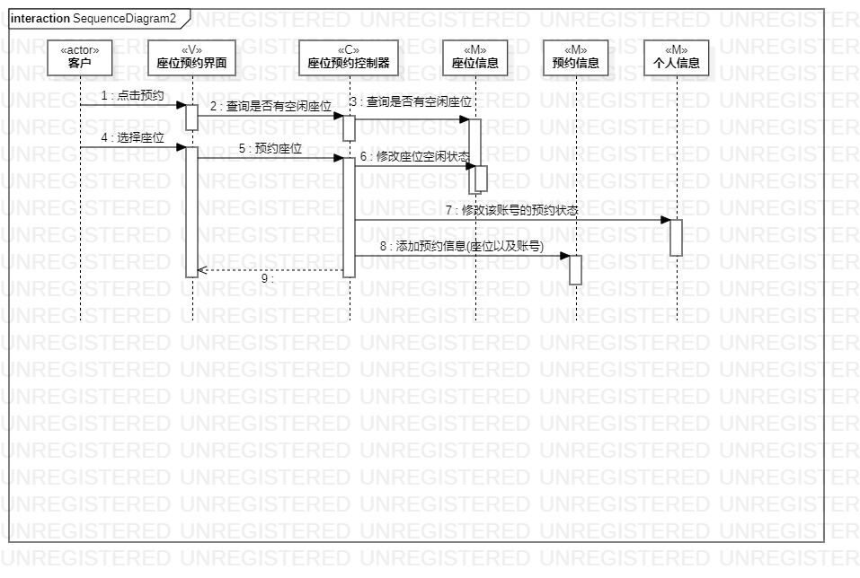

# 实验六 交互建模

## 一、实验目标

### 1.理解系统交互；
### 2.掌握UML顺序图的画法；
### 3.掌握对象交互的定义与建模方法。

## 二、实验内容

### 1. 根据用例模型和类模型，确定功能所涉及的系统对象；
### 2. 在顺序图上画出参与者（对象）。
### 3. 在顺序图上画出消息（交互）。

## 三、实验步骤

### 1. 在StarUML中创建SequenceDiagram;
### 2. 画出用例的参与者并说明属于什么类;
### 3. 用message有序地连接各个类并说明他们之间的关系;

## 四、实验结果

图1：网费充值顺序图

图2：座位预约顺序图

