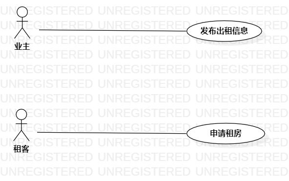

# 实验二：用例建模
## 1.实验目标
- 掌握用例图画法
- 掌握用例规约
## 2.实验内容
- 确定选题
- 创建选题的用例图
- 编写用例规约
## 3.实验步骤
- 确定功能：  
  （1）发布出租信息：业主填写房屋信息  
  （2）申请租房：租客申请适合自己的房屋  
- 画出参与者：业主和租客
- 画出用例
- 建立参与者和用例的联系
- 编写用例规约
## 4.实验结果
  
房屋出租系统的用例图  
# 用例规约的编写

## 表1：发布出租信息用例规约  

用例编号  | UC01 | 备注  
-|:-|-  
用例名称  | 发布出租信息  |   
前置条件  |  业主已经登录进入房屋出租系统    | *可选*   
后置条件  |      | *可选*   
基本流程  | 1. 业主点击发布信息按钮 |*用例执行成功的步骤*    
~| 2. 系统显示房屋信息发布界面 |   
~| 3. 业主填写房屋的价格，地址，租期，外观等信息并且留下自己的联系电话  |   
~| 4. 系统审核业主信誉值， 信誉值及格，可以发布出租信息 |   
~| 5. 系统提示“发布成功”  |  
扩展流程  | 4.1  系统审核业主信誉值，发现业主之前因为被租客多次举报房屋信息不属实而导致信誉值过低，提示“你的信誉值过低，无法发布出租信息” |*用例执行失败*    

## 表2：申请租房用例规约  

用例编号  | UC02 | 备注  
-|:-|-  
用例名称  | 申请租房  |   
前置条件  |   租客已经登录进入房屋出租系统   | *可选*   
后置条件  |      | *可选*   
基本流程  | 1. 租客选择房屋所在的地点 |*用例执行成功的步骤*    
~| 2. 系统显示该地点的所有可租房屋 |   
~| 3. 租客选择适合自己的房屋  |   
~| 4. 租客点击申请按钮  |   
~| 5. 系统审核租客信誉值，信誉值及格，可以申请租房  |  
~| 6. 系统提示“申请成功”  | 
扩展流程  | 5.1 系统审核租客信誉值，发现租客因为有多次拖欠租金记录而导致信誉值过低，提示“你的信誉值过低，无法申请租房”  |*用例执行失败*    
