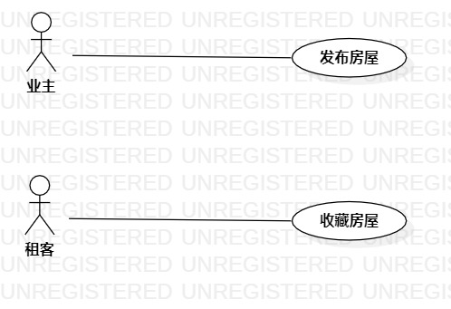

# 实验二：用例建模
## 1.实验目标
- 掌握用例图画法
- 掌握用例规约
## 2.实验内容
- 确定选题
- 创建选题的用例图
- 编写用例规约
## 3.实验步骤
- 确定功能：  
（1）业主发布房屋  
（2）租客收藏房屋
- 画出参与者：业主和租客
- 画出用例
- 建立参与者和用例的联系
- 编写用例规约
## 4.实验结果
  
房屋出租系统的用例图  

# 用例规约的编写

## 表1：发布房屋用例规约  

用例编号  | UC01 | 备注  
-|:-|-  
用例名称  | 发布房屋  |   
前置条件  |  业主已经登录进入房屋出租系统    |    
后置条件  |      |    
基本流程| 1. 业主填写房屋的价格，地址，租期，外观等信息并且留下自己的联系电话 |   
~| 2. 业主点击发布按钮 |  
~| 3. 系统检查业主的必填内容，必填内容不为空 | 
~| 4. 系统查询业主信誉值， 信誉值高于60，保存出租信息 |   
~| 5. 系统提示“发布成功” |  
扩展流程  | 3.1  系统检查业主的必填内容，必填内容为空，提示“必填内容为空，无法发布” | 
~| 4.1  系统查询业主信誉值，发现业主信誉值低于60，提示“你的信誉值过低，无法发布” | 

## 表2：收藏房屋用例规约  

用例编号  | UC02 | 备注 
:--|:-|-  
用例名称  | 收藏房屋  |   
前置条件  |   租客已经登录进入房屋出租系统   |    
后置条件  |      |    
基本流程  | 1. 租客选择房屋 |    
~| 2. 租客点击收藏按钮 |   
~| 3. 系统查询房屋，存在该房屋 |
~| 4. 系统查询租客已收藏的房屋，不存在编号相同的房屋 |
~| 5. 系统查询租客房屋收藏个数，未超过收藏上限 |
~| 6. 系统保存房屋收藏信息 |
~| 7. 系统提示“收藏成功” | 
扩展流程  | 3.1 系统查询房屋，发现房屋不存在，提示“此房屋已被删除” | 
 | 4.1 系统查询租客已收藏的房屋，发现存在编号相同的房屋，提示“此房屋已收藏” | 
 | 5.1 系统查询租客房屋收藏个数，检查超过收藏上限，提示“收藏房屋个数已满，无法再收藏” | 
 |  | 
