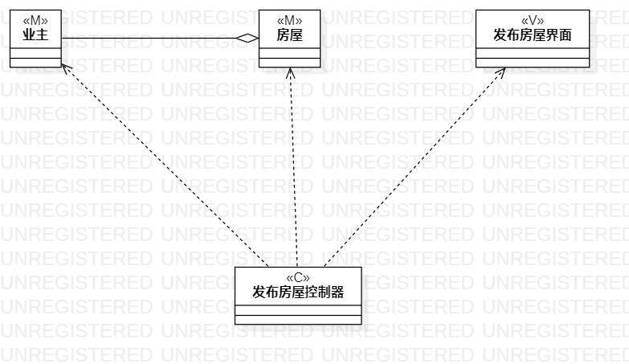
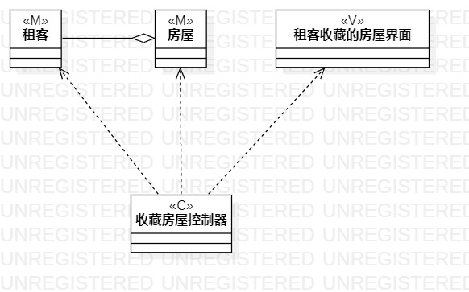

# 实验四：类建模
## 1.实验目标
- 掌握类之间关系的画法
- 了解Model，View，Controller
- 理解类的5种关系
## 2.实验内容
- 熟悉类图的画法
- 根据实验二的用例规约，画出类图
- 了解并熟悉MVC模式
## 3.实验步骤
- 根据实验二的用例规约画出对应的类图
- 在用例规约中找出模型，视图，控制器
- 把有关系的类连接起来，连接控制器与相关的类，连接控制器与相关的视图
## 4.上课笔记
- 类的5种关系：Dependency，Association，Aggregation，Composition，Inheritance
- Model：即是模型，实体，数据
- View：也即是视图，界面
- Control：也即是控制器，Service
- 有多少个用例就画多少个类图
## 5.实验结果
    
发布房屋类图  

  
收藏房屋类图