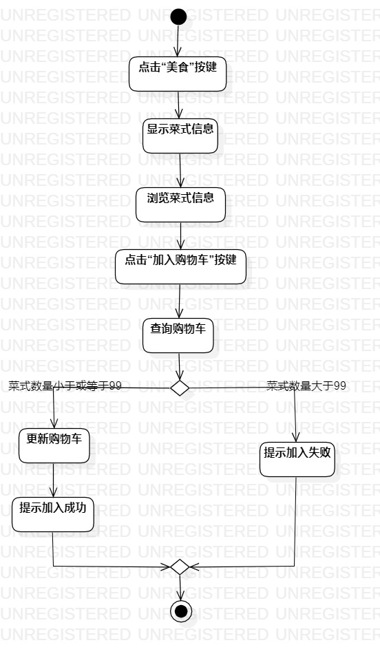
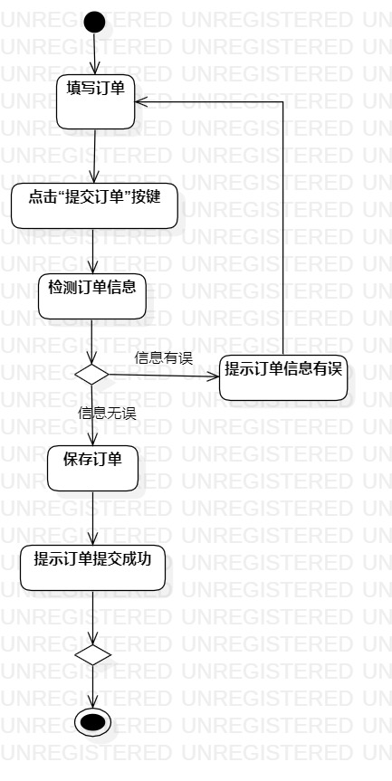

# 实验三：过程建模

## 一、实验目标

1.掌握过程建模的方法，

2.掌握活动图的画法

## 二、实验内容

1.学习活动图的画法

2.根据编写的用例规约画出活动图

## 三、实验步骤

1.在StarUML上新建 选择菜式/确认下单 的活动图

2.在图上添加“开始”Initial和“结束”Final

3.根据用例规约将各流程逐步添加为Action

4.添加决策，根据用例规约的扩展流程，确定不同的条件的结果

5.使用Control Flow将Initial、Action、Decision以及Final按流程相连

## 四、实验结果
图1.选择菜式活动图

图2.确认下单活动图

