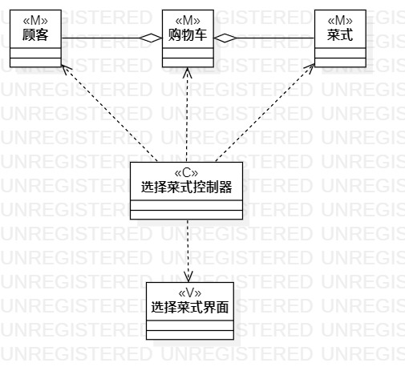
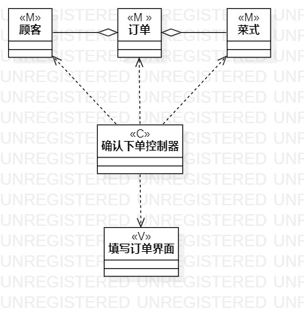

# 实验四、五：类建模

## 实验目标

1.掌握类建模的方法；

2.了解MVC设计模式；

3.掌握类图的画法。

## 实验内容

1.基于MVC模式设计类；

2.设计类的关系，并画出类图。

## 实验步骤

1.创建class，分为model类、view类和control类；

2.根据用例规约，对类进行命名；

3.根据类的关系使用Aggregation进行连接。

## 实验结果
图1.选择菜式的类图

图2.确认下单的类图

