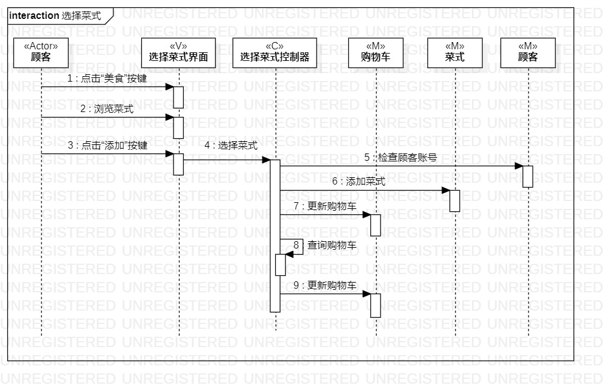
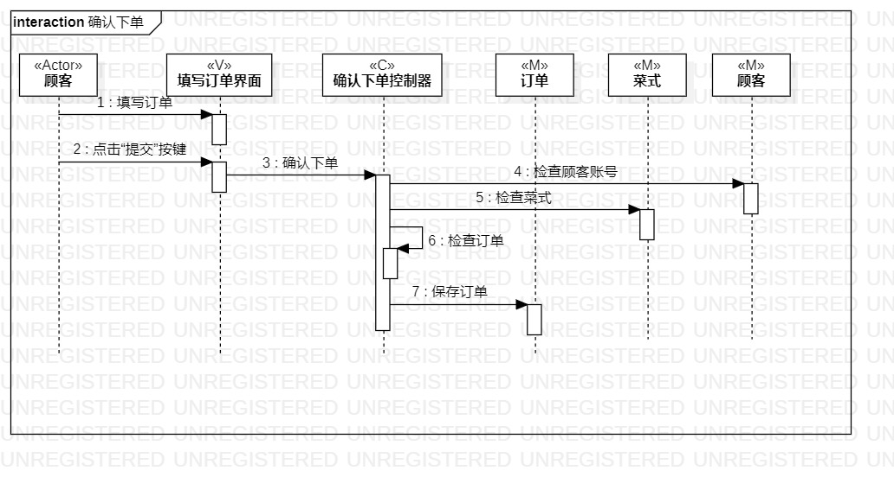

# 实验六：交互建模

## 实验目的

1.理解系统的交互；

2.掌握UML顺序图的画法；

3.掌握对象交互的定义以及建模方法。

## 实验内容

1.根据用例模型和类模型，确定功能所涉及的系统对象；

2.在顺序图上画出参与者；

3.在顺序图上画出交互。

## 实验步骤

1.新建Sequence Diagram，然后根据类图添加参与者；

2.根据活动图使用Message，将交互按活动图顺序画出；

3.检查顺序图是否与类图、活动图相匹配。

## 实验结果

图1.选择菜式顺序图

图2.确认下单顺序图
