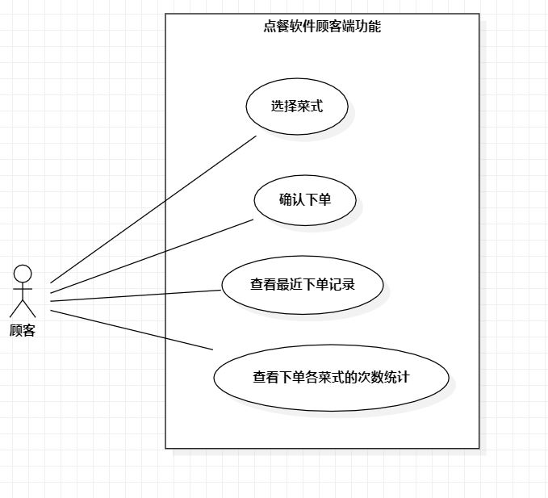

# 实验二

## 一、实验目的
1.掌握基于UML的建模概念与方法；

2.掌握使用StarUML画用例图。

## 二、实验内容
1.创建选题；

2.细化功能需求；

3.画出选题用例图；

4.编写用例规约表格。

## 三、实验步骤
1.创建点餐软件选题，定义软件顾客端的功能；

2.绘制点餐软件用例图

（1）使用use case构建软件提供给顾客的功能的用例；

（2）使用Association将顾客和功能相连。

3.编写点餐软件的用例规约表格。

## 四、实验结果

图1.点餐软件用例图

# 用例规约的编写

## 表1：选择菜式用例规约  

用例编号  | UC01 | 备注  
-|:-|-  
用例名称  | 选择菜式  |   
前置条件  | 应用连接网络   | *可选*   
后置条件  |     | *可选*   
基本流程  | 1. 顾客打开应用  |*用例执行成功的步骤*    
~| 2. 应用连接网络  |   
~| 3. 应用弹出菜式信息界面    |   
~| 4. 顾客选择菜式  |     
扩展流程  | 2.1 应用显示连接网络失败  |*用例执行失败*    

## 表2：确认下单用例规约  

用例编号  | UC02 | 备注  
-|:-|-  
用例名称  | 确认下单  |   
前置条件  |  顾客挑选菜式结束    | *可选*   
后置条件  |      | *可选*   
基本流程  | 1. 顾客点击下单按键  |*用例执行成功的步骤*    
~| 2. 应用显示订单信息 |   
~| 3. 顾客点击确认付款按键 |   
~| 4. 应用显示下单完成  |    
扩展流程  | 3.1 应用显示余额不足   |*用例执行失败*    

## 表3：查看下单记录用例规约  

用例编号  | UC03 | 备注  
-|:-|-  
用例名称  |查看下单记录 |   
前置条件  |      | *可选*   
后置条件  |      | *可选*   
基本流程  | 1. 顾客点击查看记录按键  |*用例执行成功的步骤*    
~| 2. 应用查找顾客下单记录  |   
~| 3. 应用显示下单记录  |    
扩展流程  | 2.1 应用检查到没有记录  |*用例执行失败*     
