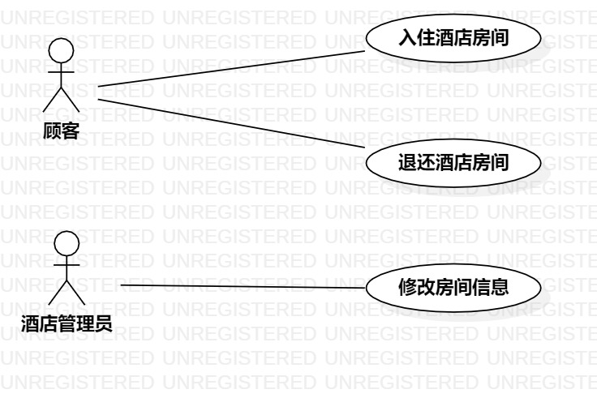

# 实验二：用例建模

## 一、实验目标：

1.确定Issues选题

2.完成用例建模

3.撰写实验报告

## 二、实验内容：

1.上传Issue选题

2.在StarUML完成用例建模，画出用例图

3.编写用例规约

## 三、实验步骤：

1.确定自己的选题：酒店自助入住管理系统

2.确定用例（Use case）以及参与者

用例：

- 入住酒店房间

- 退还酒店房间

- 修改房间信息

参与者：

- 顾客

- 酒店管理员

3.运用StarUML画出用例图，完成用例建模

4.根据用例建模编写用例规约

## 四、实验结果：

### 1.用例图

图1：酒店自助入住管理系统用例图

### 2.用例规约

### 表1：入住酒店房间用例规约  

用例编号  | UC01 | 备注  
-|:-|-  
用例名称  | 入住酒店房间  |   
前置条件  |   登录   |    
后置条件  |      |    
基本流程  | 1. 顾客选择所需房型 |       
~| 2. 系统显示相对应房型号所有房间 |   
~| 3. 顾客浏览界面，选择所需房间  |   
~| 4. 系统显示支付方式  |   
~| 5. 顾客选择支付方式并扫码支付  | *包含押金*   
~| 6. 系统显示“支付成功”，并修改房间为“满员”状态 |
扩展流程  | 2. 系统显示“该房型号已无空闲房间”，返回“选择房型”页面 |    
~| 6. 系统显示“支付失败，请更换支付方式”  |  

### 表2：退还酒店房间用例规约  

用例编号  | UC02 | 备注  
-|:-|-  
用例名称  | 退还酒店房间 |   
前置条件  | 入住酒店房间 |    
后置条件  |      |    
基本流程  | 1. 顾客要退还的房间  |    
~| 2. 系统检查该房间入住顾客信息与登录者信息一致，显示押金、房间信息等信息 |   
~| 3. 顾客检查信息无误，点击“确认退房”  |   
~| 4. 系统退还押金到原账户，修改房间为“空闲”状态  |   
扩展流程  | 2. 系统检查该房间入住顾客信息与登录者信息不一致，显示“请检查房间是否错误或更改登录账号”  |    
~| 3. 顾客检查信息有误，点击“联系前台”  |  

### 表3：修改房间信息用例规约  

用例编号  | UC03 | 备注  
-|:-|-  
用例名称  | 修改房间信息 |   
前置条件  |  登录  |    
后置条件  |      |    
基本流程  | 1. 酒店管理员选择需要更改信息的房间  |    
~| 2. 系统显示该房间所有信息  |   
~| 3. 酒店管理员更改信息，并按“保存”按钮  |   
~| 4. 系统显示“修改成功”，返回首页  |   
~| 5.   |  
扩展流程  | 4. 系统显示“修改失败，请确认重要信息已填写”，返回修改页面  |    
~|    |  
