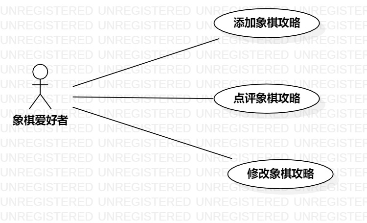

# 实验二：用例建模

## 一、实验目标：

1.确定Issues选题

2.完成用例建模

3.撰写实验报告

## 二、实验内容：

1.上传Issue选题

2.在StarUML完成用例建模，画出用例图

3.编写用例规约

## 三、实验步骤：

1.确定自己的选题：象棋攻略分享系统

2.确定用例（Use case）以及参与者

用例：

- 添加象棋攻略

- 点评象棋攻略

- 修改象棋攻略

参与者：

- 象棋爱好者

3.运用StarUML画出用例图，完成用例建模

4.根据用例建模编写用例规约

## 四、实验结果：

### 1.用例图

图1：象棋攻略分享系统用例图

### 2.用例规约

### 表1：添加象棋攻略用例规约  

用例编号  | UC01 | 备注  
-|:-|-  
用例名称  | 添加象棋攻略  |   
前置条件  |   登录   |    
后置条件  |      |    
基本流程  | 1. 象棋爱好者点击攻略界面的“添加攻略”按钮 |       
~| 2. 系统显示所需填写的信息 |   
~| 3. 象棋爱好者填写信息，撰写攻略，点击“上传”按钮  |   
~| 4. 系统检查必填信息已全部填写，保存攻略，显示“上传成功”  |   
~| 5.  |    
~| 6.  |
扩展流程  | 4. 系统检查必填信息未全部填写，显示“上传失败，请确认必填信息已全部填写” |    
~|   | 

### 表2：点评象棋攻略用例规约  

用例编号  | UC02 | 备注  
-|:-|-  
用例名称  | 点评象棋攻略  |   
前置条件  |   登录   |    
后置条件  |      |    
基本流程  | 1. 象棋爱好者浏览攻略界面，选择想要评价的攻略 |       
~| 2. 系统显示评价界面 |   
~| 3. 象棋爱好者撰写对该攻略的评价，点击“发表” 按钮 |   
~| 4. 系统检查所写评价无违法字眼，保存评价内容并更新攻略信息，显示“发表成功”，返回攻略界面  |   
~| 5.  |    
扩展流程  | 4. 系统检查所写评价存在违法字眼，显示“发表失败，请检查评价是否存在违法字眼” |    
~| 5.  | 

### 表3：修改象棋攻略用例规约  

用例编号  | UC03 | 备注  
-|:-|-  
用例名称  | 修改象棋攻略  |   
前置条件  |   登录   |    
后置条件  |      |    
基本流程  | 1. 象棋爱好者在个人中心界面，选择要修改的攻略 |       
~| 2. 系统显示攻略的内容与信息 |   
~| 3. 象棋爱好者更改信息，确认无误后，点击“保存”按钮 |   
~| 4. 系统检查重要信息已全部填写，保存所有修改信息，显示“修改成功”，返回攻略界面  |   
~| 5.  |    
扩展流程  | 4. 系统检查重要信息未完全填写，显示“修改失败，请确认重要信息已填写” |    
~| 5.  | 
