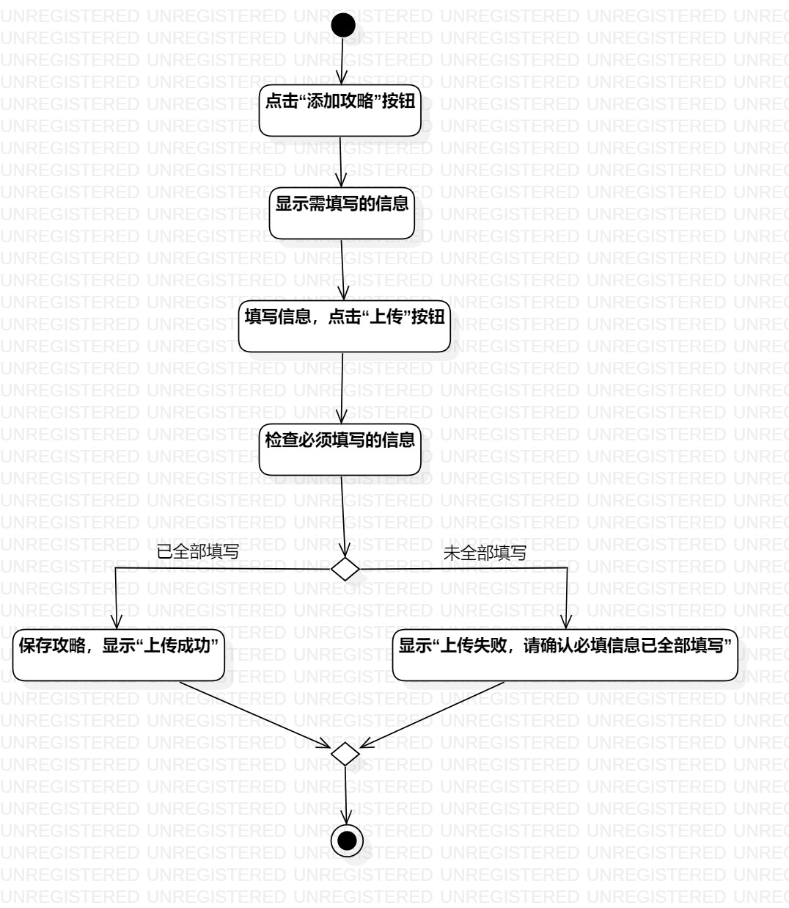
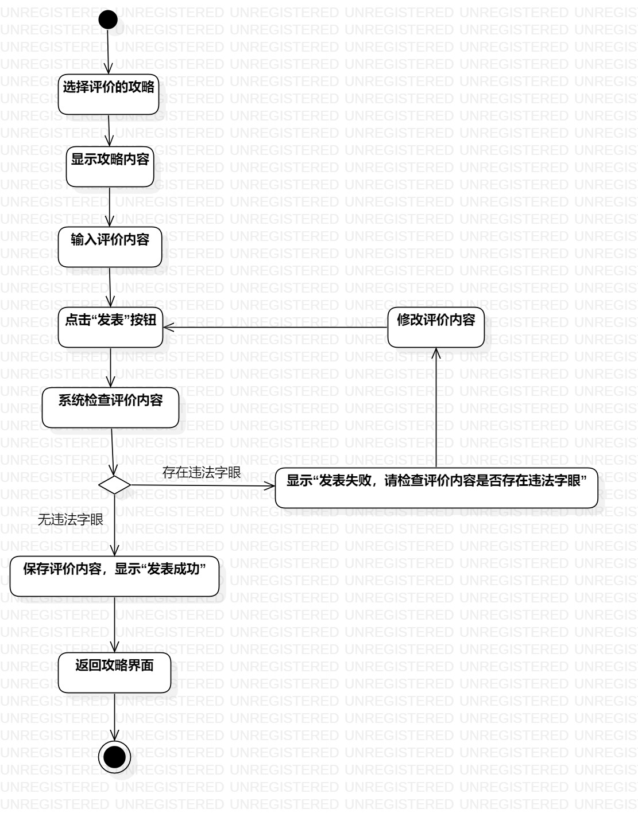
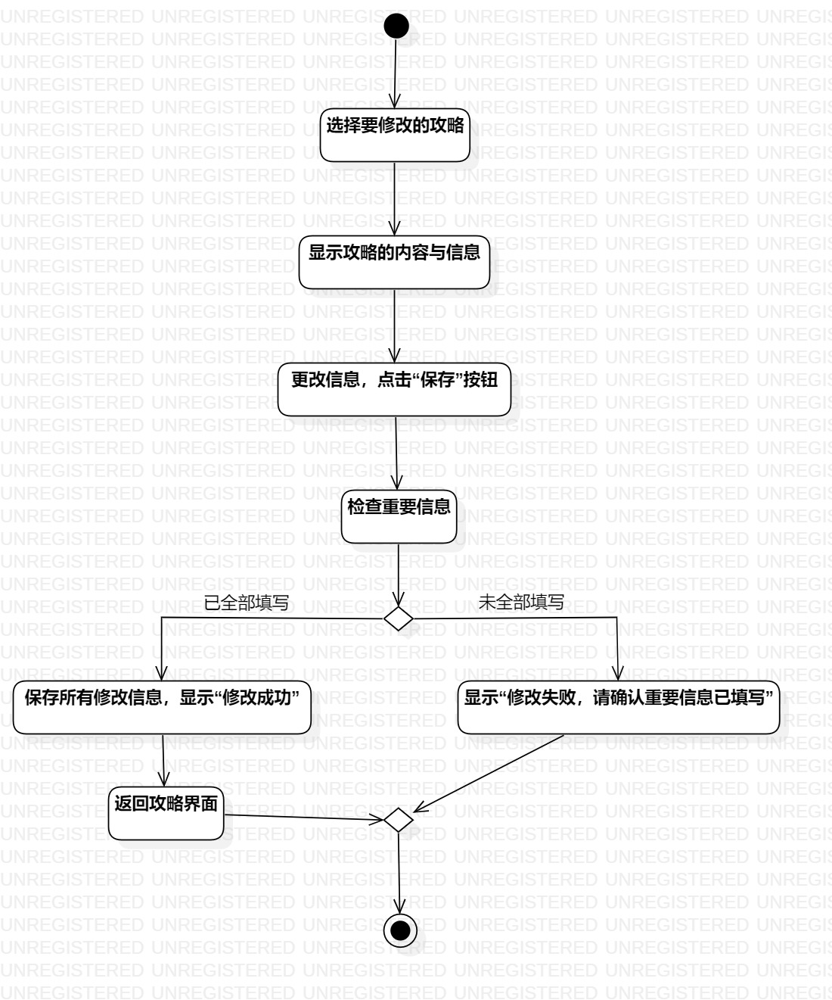

# 实验三：过程建模

## 一、实验目标

1、掌握过程建模方法

2、掌握活动图的画法（Activity Diagram）

## 二、实验内容

1、掌握过程建模的方法

2、运用StarUML绘制实验二用例规约的活动图

## 三、实验步骤

1、观看视频，熟悉实验过程以及如何运用StarUML绘制活动图

2、新建Activity Diagram，命名为“添加象棋攻略的活动图”

3、打开实验二用例规约，参照并绘制活动图，同时按需求更改用例规约

- 添加“Initial”和“Final”

- 添加“Action”，精炼并输入用例规约中的语句

- 添加“Decision”，并用“Control Flow”将各种“Activities（Basic）”连接起来

4、用同样方法绘制“点评象棋攻略的活动图”和“修改象棋攻略的活动图”

## 四、实验结果

### 活动图如下：

图1：添加象棋攻略的活动图

图2：点评象棋攻略的活动图

图3：修改象棋攻略的活动图
