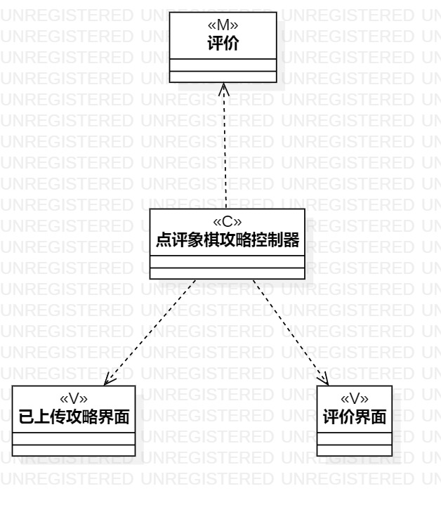
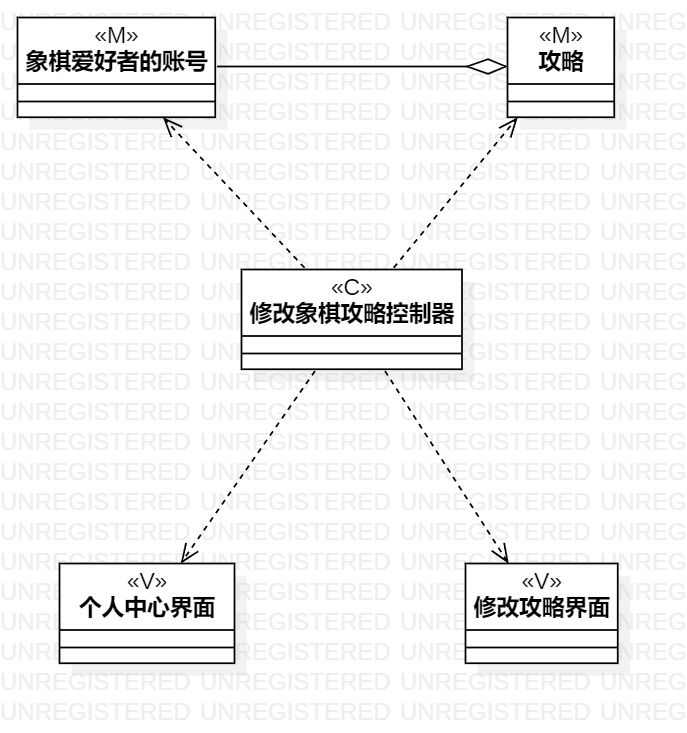

# 实验四：类建模 实验五：高级类建模

## 一、实验目标

1、掌握类建模方法

2、了解MVC或你熟悉的设计模式

3、掌握类图的画法（Class Diagram）

## 二、实验内容

1、基于MVC模式设计类

2、设计类的关系

3、画出类图

## 三、实验步骤

1、确定设计模式为MVC模式

2、在StarUML中新建Class Diagram

3、打开实验二用例规约，寻找并确定其中的类

4、用class画出类，包括控制器与界面

5、确定各class的关系，用Aggregation与Dependency连接

6、提交到GitHub上并撰写实验报告

## 四、实验结果

### 类图如下：

图1：添加象棋攻略类图

图2：点评象棋攻略类图

图3：修改象棋攻略类图
