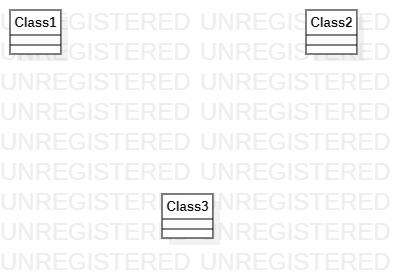

## 实验目标
- 熟悉并掌握StarUML软件的基本使用
- 熟悉在GitHub上提交作业
## 实验内容
- 下载并安装StarUML软件
- 复习github上的提交作业操作
## 实验步骤
- Fork主库项目
- clone项目到个人库及本地库
- 在students文件夹中新建个人学号文件夹
- 使用StarUML画一张图并保存到本地库个人学号文件夹下
- 将md文件上传到Github上
- 将图片上传到GitHub个人库中
- 编写好实验报告后发送pull request请求
## 实验结果

