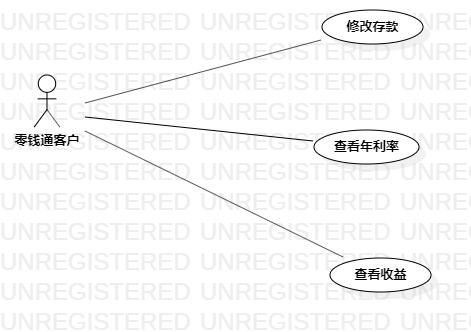

# 实验二

## 一. 实验目标
1. 确定选题
2. 学习用例建模

## 二. 实验内容
1. 参考同学们的选题，来确定个人建模选题，并填写在 new Issues 中：https://github.com/hzuapps/uml-modeling-2020/issues
2. 根据老师的指导视频画出用例图

## 三. 实验步骤
1. 首先参考同学们选题，并提交个人选题
2. 使用 StarUML 画用例图

## 四.实验结果
1. 选题：零钱通管理系统：让客户清楚的掌控自己理财产品的余额、年利率、收益情况。   
 1.1  修改个人余额：客户可以根据自己的经济情况，把剩余的零钱充值进零钱通来增加收入，或者支出零钱通里的余额，从而灵活管理自己的零钱。   
 1.2  查看年利率、收益：客户可以通过系统的查询功能，随时随地的查询自己零钱通里零钱的年利率和收益，清楚地掌控自己的每一分钱。   
  
2.  
