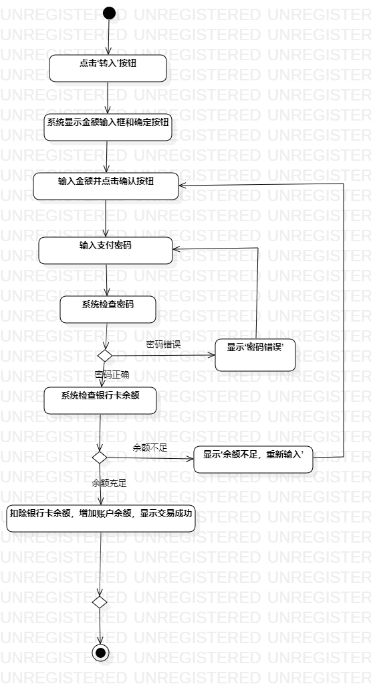
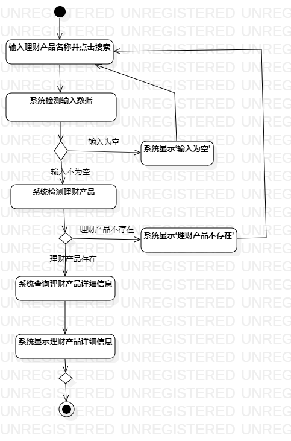

#  实验三   过程建模
##  一、实验目标

1.  掌握过程建模方法；
2.  掌握活动图的画法。

##  二、实验内容
1.  观看实验3相关视频；  
2.  依据视频用StarUML完成活动图。  
3.  完成实验报告；  

##  三、实验步骤  
1. 在StarUML创建两个活动图：  
（1）存钱；  
（2）查看收益。  

2.  根据用例规约画出活动图：  
（1） 添加Initial和Final节点；   
（2） 添加活动；     
（3） 添加扩展流程；   
（4） 添加决策节点。   
##  四、实验结果
图1 存钱活动图
  

图2 查看收益活动图
  

