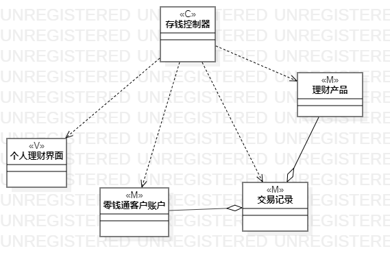
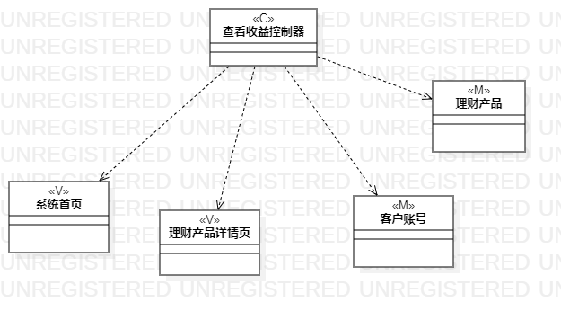

# 实验四、五：类建模
## 一、实验目标 
1. 掌握类建模方法
2. 掌握MVC
3. 掌握类图的画法
## 二.实验内容
 根据实验二中的用例规约画相关类图
  1. 存钱用例类图
  2. 查看受益类图
## 二、实验步骤
1. 浏览老师的实验要求
1. 观看相关实验教程视频与问题讲解视频
2. 根据实验二存钱用例规约和查看收益用例规约，找出其中的类
3. 画出类图，并连接
## 三、实验结果
  
图1：存钱用例类图  

  
图2：查看收益用例类图  
