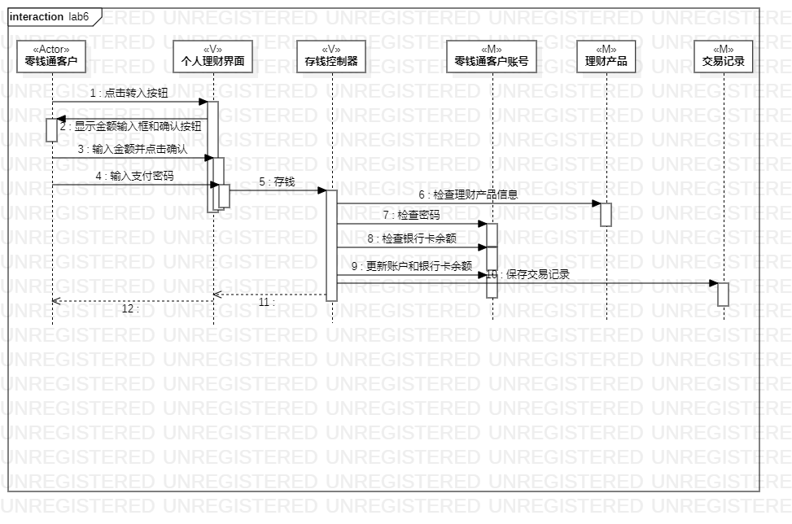
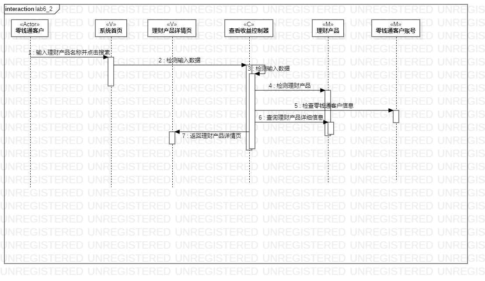

# 实验六：交互建模

## 1.实验目标
1. 理解系统交互；
2. 掌握UML顺序图的画法；
3. 掌握对象交互的定义与建模方法。

## 2. 实验内容
1. 根据用例模型和类模型，确定功能所涉及的系统对象；
2. 在顺序图上画出参与者（对象）；
3. 在顺序图上画出消息（交互）；

## 3. 实验步骤
1. 浏览老师的实验要求
2. 观看相关实验教程视频与问题讲解视频
3. 从活动图和类图中找出参与者Actor、Model、View、Controller
4. 根据活动图，提取相关步骤，画出本次实验的顺序图 

 （1） 发表博文
   用户（a）、博文列表页面（v）、发布博文页面（V）、发表博文控制器（c）、用户（m）、博文（m）；
   
 （2）. 发表评论
   用户（a） 评论列表页面（v）、发布评论页面（V）、发表评论控制器（c）、用户（m）、博文（m）、评论（m）；

## 4. 实验结果

图1：存钱顺序图
  

图2：查看收益顺序图
  
