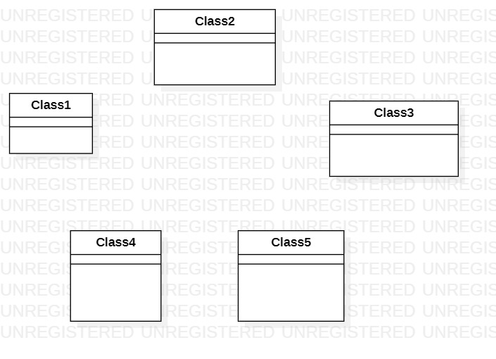

# 实验一

## 1 实验目标
1.1 下载StarUML软件     
1.2 学会GitHub的基本使用   

## 2 实验内容
2.1 下载并安装建模工具StarUML      
2.2 下载GUI，并上传文件至GitHub，并实现拉取到老师的库中  

## 3 实验步骤
3.1 查看视频，并下载建模工具相关压缩包并实现安装StarUML    
3.2 使用StarUML建模工具创建一个uml图   
3.3 通过命令行将自己GitHub上的库上传至本机  
3.4 在本机创建lab1.md文件  
3.5 将lab1.md与test1model.jpg文件上传至GitHub本地仓库  
3.6 在GitHub本地仓库提交文件至老师的库中  

## 4 实验结果

