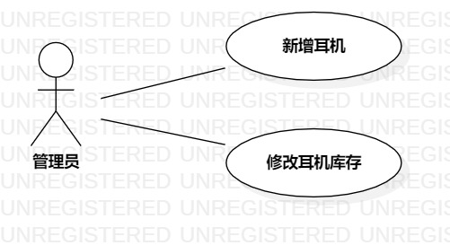

# 实验二 用例建模

## 实验目标
1 掌握创建用例图     
2 掌握编写用例规约     

## 实验内容
1. 创建用例图    
2. 编写用例规约   

## 实验步骤
1. 创建并提交新选题（入耳式耳机管理系统）#661
2. 创建用例图：
3. 确认参与者：管理员   
 1）添加用例：新增耳机       
 2）添加用例：修改耳机库存   
 3）建立用例与参与者之间的联系   
4. 编写用例规约
 1）编写新增耳机用例规约   
 2）编写修改耳机库存用例规约   
 
## 实验结果

   

## 表2：新增耳机用例规约  

| 用例编号 | uc01                                                        | 备注                 |
| -------- | :-------------------------------------------------------- | -------------------- |
| 用例名称 | 新增耳机                                                    |                      |
| 前置条件 | 管理员已经登录系统                                       | *可选*               |
| 后置条件 |                                                            | *可选*               |
| 基本流程 | 1. 管理员点击新增耳机按钮；| *用例执行成功的步骤* |
| ~        | 2. 系统显示输入耳机相关信息；|                      
| ~        | 3. 管理员填写耳机参数，数量和价格，点击提交按钮；|                      
| ~        | 4. 系统查询耳机信息，检查是否存在，保存耳机信息和数量；|                      
| ~        | 5. 系统返回“新增耳机成功”提示信息；|                      
|扩展流程   | 4.1系统检测型号已存在，返回“该耳机型号已存在”提示信息; | *用例执行失败*       |
 
## 表3：修改耳机库存用例规约  

| 用例编号 | uc02                                                        | 备注                 |
| -------- | :-------------------------------------------------------- | -------------------- |
| 用例名称 | 修改耳机库存                                                   |                      |
| 前置条件 | 管理员进入库存管理系统                                       | *可选*               |
| 后置条件 |                                                            | *可选*               |
| 基本流程 | 1. 管理员点击库存修改按钮；| *用例执行成功的步骤* |
| ~        | 2. 系统显示耳机库存界面；|                      
| ~        | 3. 耳机管理员选择耳机型号并修改其库存数量，点击提交按钮；|                      
| ~        | 4. 系统修改库存；|
| ~        | 5. 系统返回“修改库存成功”提示信息；|                      
|扩展流程   | 3.1系统检测耳机库存小于最低库存，返回“库存数目不能小于0”提示信息；  | *用例执行失败*      |
|          | 3.1系统检测耳机库存大于最高库存，返回“库存数目不能大于999”提示信息；  |
