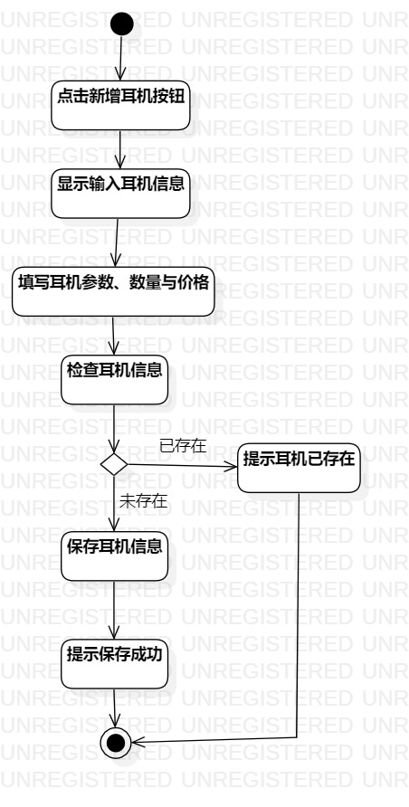
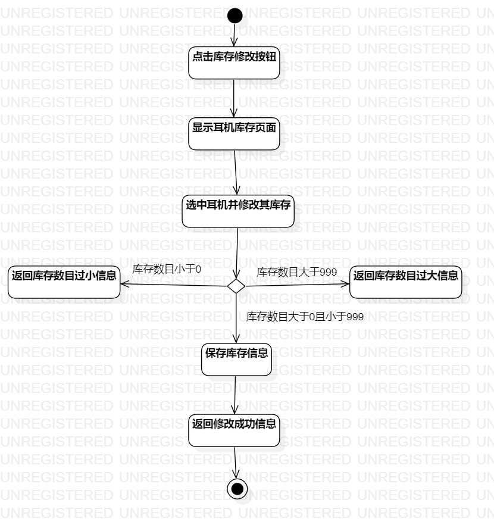

# 实验三 过程建模

## 实验目标
1 掌握过程建模的方法    
2 掌握活动图的画法

## 实验内容
1. 画出活动图    
2. 编写实验报告   

## 实验步骤
1. 打开实验2所作的用例规约
2. 打开StarUML并编写活动图：
3. 编写新增耳机活动图：   
 1）创建起始节点       
 2）根据用例规划添加活动与决策点   
 3）创建结束节点   
4. 编写修改耳机库存活动图：   
 1）创建起始节点       
 2）根据用例规划添加活动与决策点   
 3）创建结束节点    
## 实验结果

   
图1：添加耳机活动图

   
图2：修改耳机库存活动图
