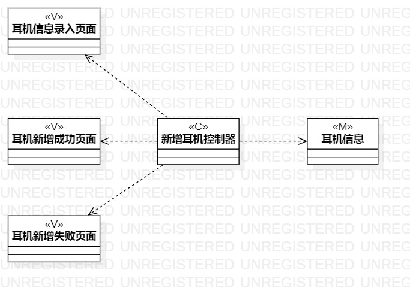
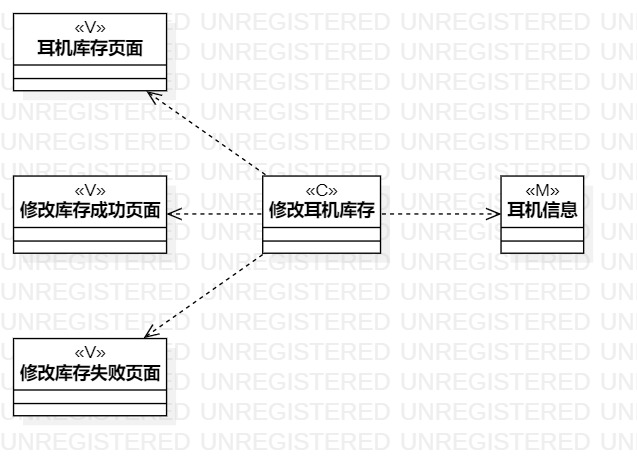

# 实验四：类建模
# 实验五:高级类建模

## 一、实验目标

1. 学习类建模的概念
2. 理解什么是类，学习类的五种关系
3. 学习MVC设计模式以及类图的基本画法

## 二、实验内容

1. 学习类及类图的概念
2. 依据MFC设计模式绘制类图

## 三、实验步骤

1. 从视频中学习类建模知识和MVC设计模式
2. 从实验一的3个用例规约中寻找功能中涉及的相关类
3. 分析并确定类间关系
4. 根据分析结果基于MVC模式设计类图
5. 在StarUML中画出类图

## 四、实验结果

**图1：新增耳机的类图**

**图2：修改耳机库存的类图**

