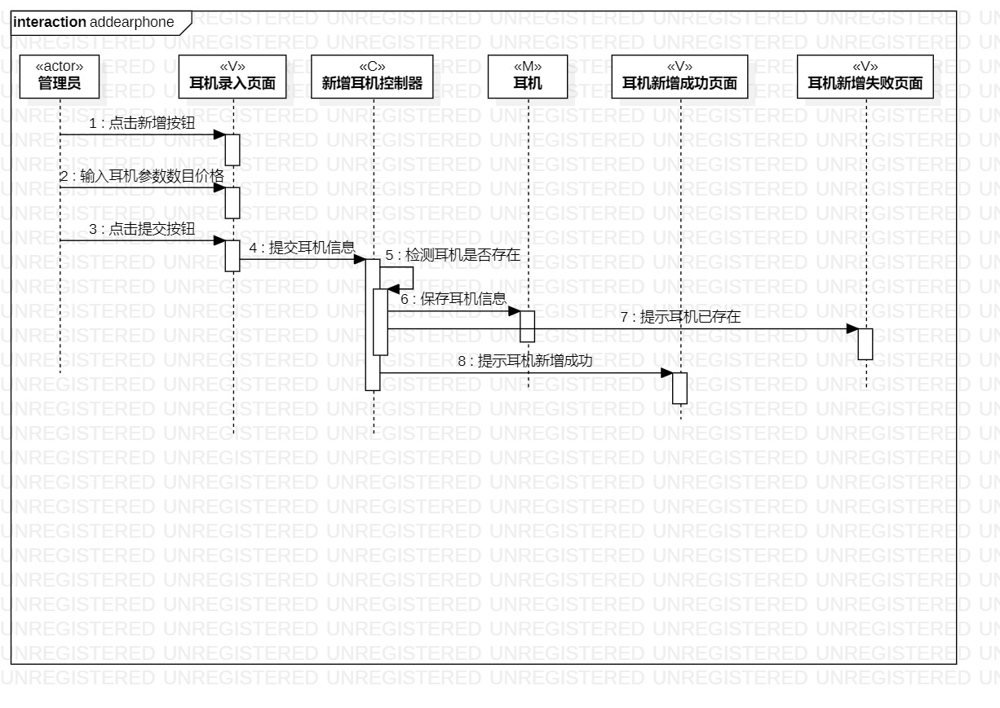
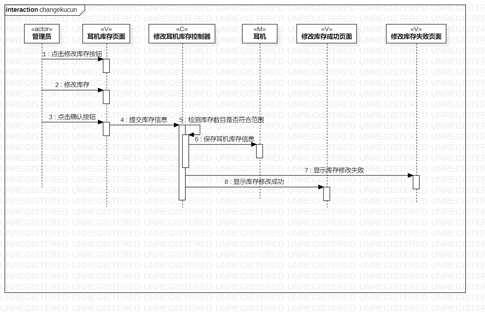

# 实验六：交互建模

## 一、实验目标
1. 理解系统交互  
2. 掌握UML顺序图的画法  
3. 掌握对象交互的定义与建模方法  

## 二、实验内容
1. 交互建模，画顺序图

## 三、实验步骤
1. 观看视频学习顺序图的知识  
2.在画顺序图时，参考之前的用例规约，用例图以及类图       
3.画“新增耳机”顺序图，并修改第三次实验的过程建模图   
4. 画“修改耳机库存”顺序图，并修改第三次实验中的过程建模图  

## 四、实验结果
  
图1.新增耳机的顺序图  

  
图2.修改耳机库存的顺序图
