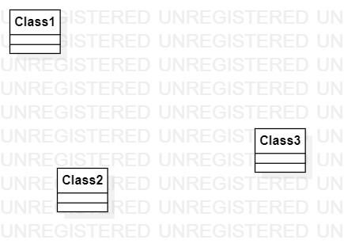

# 实验一

## 一.实验内容
  1.熟悉GitHub实验过程    
  2.安装与使用StartUml
## 二.实验内容
  1.安装GitHub并练习使用git Bash  
  2.安装StartUml并创建一个图
## 三.实验步骤
  1.下载Git和StartUml并按照步骤安装  
  2.使用Git Bash克隆项目到本地  
  3.使用StartUml创建第一个图  
  4.将第一个图上传到github自己的库中  
  5.申请合并到主项目库  
## 四.实验结果
1.画图 

  
图1.在StartUml上创建的第一个图
