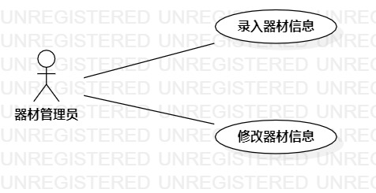

# 实验二 用例建模

## 实验目标
1 掌握创建用例图     
2 掌握编写用例规约     

## 实验内容
1. 创建用例图    
2. 编写用例规约   

## 实验步骤
1. 创建并提交新选题
   所选题目为：运动器材管理系统 #650
2. 创建用例图：
3. 确认参与者：器材管理员   
 1）添加用例：录入器材信息       
 2）添加用例：修改器材信息   
 3）建立用例与参与者之间的联系   
4. 编写用例规约  
 1）编写录入器材信息用例规约   
 2）编写修改器材信息用例规约   

## 实验结果  
 

  图1.运动器材管理系统用例图
  
### 表1：录入器材信息用例规约 
用例编号  | UC01 | 备注 
-|:-|-  
用例名称  | 录入器材信息  |  
前置条件  | 器材管理员登入系统  | *可选*  
后置条件  |   | *可选*  
基本流程  | 1. 器材管理员点击新建器材信息按钮  |  
~| 2. 系统显示录入器材页面  |  
~| 3. 器材管理员输入器材信息  |  
~| 4. 器材管理员点击保存按钮  |  
~| 5. 系统检查信息合法规范  |  
~| 6. 系统保存器材信息  |  
扩展流程  | 5.1 信息输入不合规范，系统提示保存器材信息失败  | *用例执行失败*  

### 表2：修改器材信息用例规约 
用例编号  | UC02 | 备注 
-|:-|-  
用例名称  | 修改器材信息  |  
前置条件  | 器材管理员登入系统  | *可选*  
后置条件  |   | *可选*  
基本流程  | 1. 器材管理员点击查看器材信息按钮  |  
~| 2. 器材管理员点击修改按钮  |  
~| 3. 系统显示修改器材页面  |  
~| 4. 器材管理员输入器材信息  |  
~| 5. 器材管理员点击保存按钮  |  
~| 6. 系统检查信息合法规范  |  
~| 7. 系统修改器材信息  |  
扩展流程  | 6.1 信息输入不合规范，系统提示修改器材信息失败  | *用例执行失败*  
