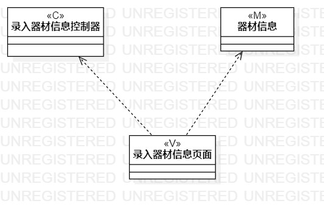
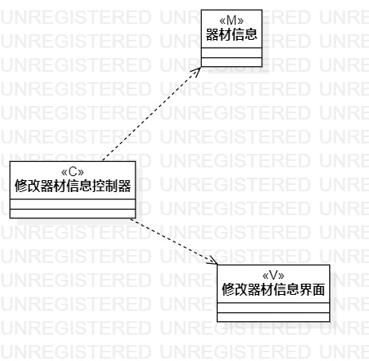

# UML实验四：类建模

## 1、实验目标
1.1、掌握类建模方法

1.2、了解MVC或熟悉的设计模式

1.3、掌握类图的画法（Class Diagram）

1.4、理解类的5种关系
## 2、实验内容
2.1、基于MVC模式设计类

2.2、根据实验二中的用例规约创建类图
## 3、实验步骤
3.1、在StarUML上创建录入器材信息类图

3.2、根据MVC模式在录入器材信息类图中创建model类“器材信息”，control类“录入器材控制器”，view类“录入器材信息界面”

3.3、给MVC三种类添加依赖关系

3.4、在StarUML上创建修改器材信息类图

3.5、根据MVC模式在修改器材信息类图中创建model类“器材信息”，control类“修改器材控制器”，view类“修改器材信息界面”

3.6、给MVC三种类添加依赖关系

3.7、编写实验报告
## 4、实验结果

图1.录入器材信息类图

图2.修改器材信息类图
