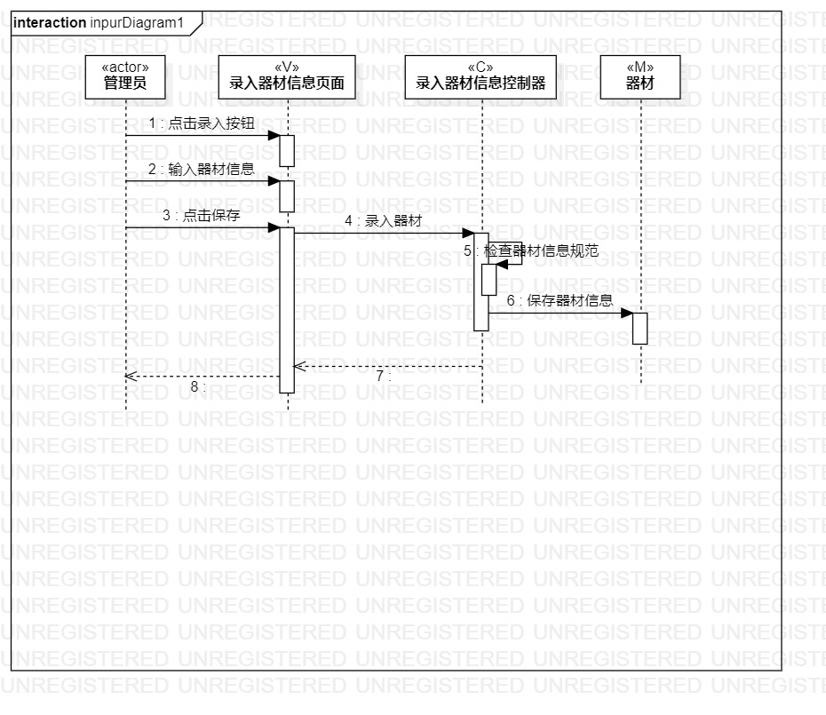
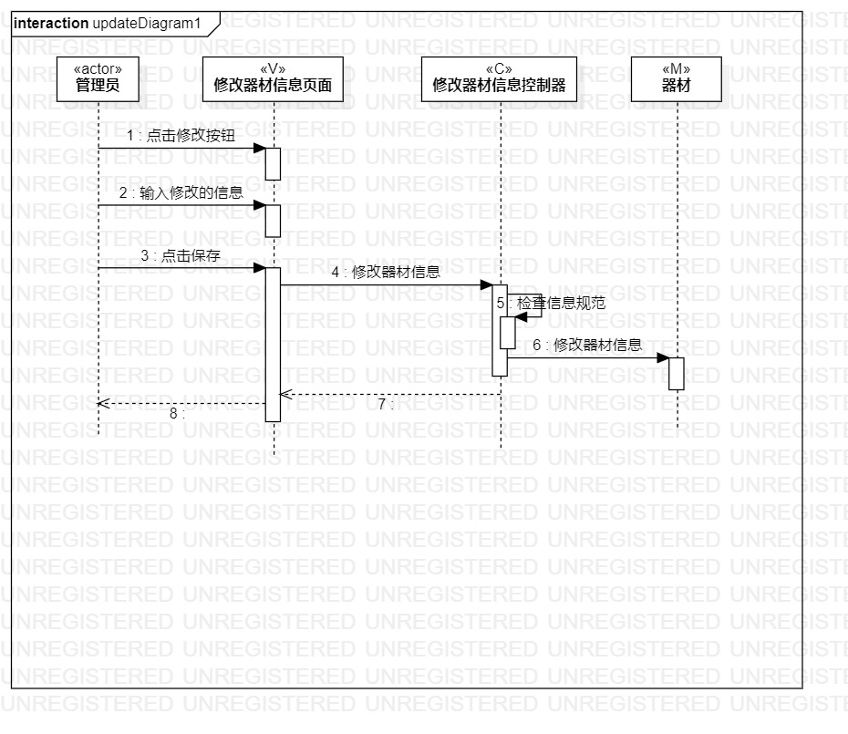

# 实验六：交互建模

 ## 一、实验目标

 1. 理解系统交互
 2. 掌握UML顺序图的画法
 3. 掌握对象交互的定义与建模方法

 ## 二、实验内容

 1. 根据用例模型和类模型，确定功能所涉及的系统对象
 2. 在顺序图上画出参与者（对象）
 3. 在顺序图上画出消息（交互）

 ## 三、实验步骤

1. 观看老师关于实验六的讲解视频 ；
2. 在StarUML创建两个顺序图（Sequence Diagram）：  
（1）录入器材信息顺序图；  
（2）修改器材信息顺序图；
3. 根据活动图和类图画顺序图：  
（1）根据N+1使用Lifeline画出actor、Model、Controller和View；  
（2）使用Message表示交互的信息；  
（3）使用Reply Message表示返回的信息。

 ## 四、实验结果

 

 图1.录入器材信息的顺序图

 

 图2.修改器材信息的顺序图
