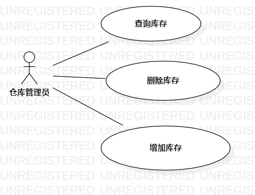

# 实验二：用例建模 
### 1.实验目标
- 使用Markdown编写报告
- 细化选题
- 学习使用StarUML用例建模 
### 2.实验内容
- 创建用例图 
- 编写实验报告文档 
- 编写用例规约 
### 3.实验步骤 
- 选题定为 
- 确定系统是参与者与事件 
- 确定参与者—仓库管理员
- 确定用例:
查询库存
修改库存
- 建立参与者与用例之间的关系 
- 用StarUML重新用例图 
- 编写用例条约 
### 4.实验结果

图1：潮鞋库存管理系统用例图 
### 表1：查询库存
| 用例编号| UC01 | 备注| 
| -------- | ---------------------------------------- | ------------------ | 
| 用例名称| 查询库存| | 
| 首要条件| 仓库管理员进入系统| 任选| 
| 后置条件| | 任选| 
| 基本流程| 1.仓库管理员点击查询按钮； | 用例执行成功的步骤| 
| | 2.系统弹出查询界面； | | 
| | 3.系统管理员输入鞋子名称，点击完成按钮； | | 
| | 4.系统检查鞋子名称不能为空，查询鞋子库存信息； | |
| | 5.系统显示鞋子库存信息页面；| |  
| 扩展流程| 4.1系统检查鞋名为空，提示“鞋子名称不能为空”| 用例执行失败 |
### 表2：修改库存
| 用例编号| UC02 | 备注|
| -------- | ----------------------------------------|------------------| 
| 用例名称| 修改库存情况| |
| 首要条件| 库存管理员已成功登录系统|任选|
| 后置条件| |任选| 
| 基本流程| 1.库存管理员点击查询按钮； |用例执行成功的步骤| 
| | 2.系统弹出查询界面；| |
| | 3.系统管理员输入鞋子名称，点击完成按钮；| | 
| | 4.系统检查鞋子名称不能为空，查询鞋子库存信息； | |
| | 5.系统显示鞋子库存信息页面；| |  
| | 6.点击修改库存按钮；| |  
| | 7.弹出修改库存界面| |
| | 8.库存管理员输入库存数目，点击完成按钮；| |
| | 9.系统检查输入库存数目不能为负数，修改鞋子库存信息；| | 
| | 10.系统显示鞋子库存信息页面；| |       
| 扩展流程| 4.1系统检查鞋名为空，提示“鞋子名称不能为空”| 用例执行失败 |
| | 9.1系统检查输入库存数目为负数，提示“修改失败”| 用例执行失败 |