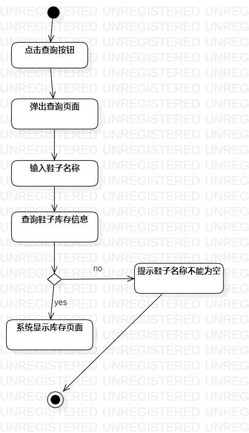
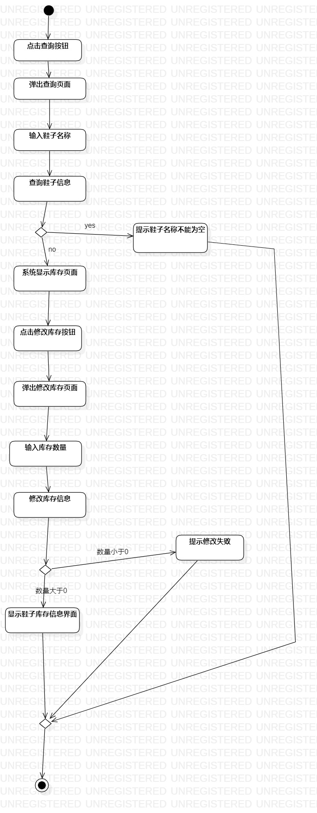

# 实验三过程建模
## 实验目标 
  1掌握过程建模的方法  
  2掌握活动图的画法 
  
   ## 实验内容 
  1.画出活动图  
  2.编写实验报告  
  
   ## 实验步骤 
  1.打开实验2实施的用例规约 
  2.打开StarUML并编写活动图： 
  3.编写查询库存活动图：  
   1）创建初始摘要  
   2）根据用例规划添加活动与决策点  
   3）创建结束摘要  
  4.编写修改库存活动图：  
   1）创建初始摘要  
   2）根据用例规划添加活动与决策点  
   3）创建结束摘要  
  ## 实验结果
  
 
  
   图1：查询库存活动图 
  
   
  
   图2：修改库存活动图
