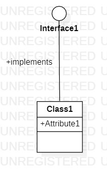

# 实验一：UML建模工具

## 实验目标

1. 认识UML并下载建模工具
2. 确定个人建模选题

## 实验要求
1. 安装StarUML，打开并截图
2. 创建实验文档，把截图保存到报告中

## 实验步骤
1. 安装StarUML，截图
2. git clone 远程库
3. 创建自己的文件夹
4. 使用git add，git commit ，git push等指令
5. github上合并请求

##实验结果

