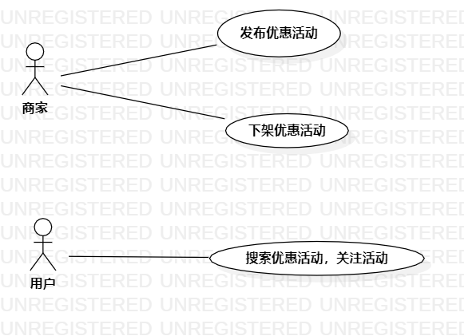

# 实验二：用例建模

## 1、实验目标 
1. 创建并完善选题
2. 根据主题用例建模
3. 提交实验文档

##2、实验内容

1. 建立个人选题项目
2. 运用UMLStar绘制用例图
3. 绘制用例规约

##3、实验步骤

### 确立系统的功能
- 发布优惠活动
- 查看优惠活动
- 添加关注
### 建立Use Case
- 确立系统扮演者（Actor）

	普通用户

	商家用户

- 建立联系（Association）

## 4、实验结果

图1：资源优惠系统的用例图

## 5、 用例规约的编写
 

### 表1：发布优惠活动用例规约  

用例编号  | UC01 | 备注  
-|:-|-  
用例名称  | 发布活动 |   
前置条件  |      | *可选*   
后置条件  | 进入活动列表页面 | *可选*   
基本流程  | 1.商家点击发布链接  |*用例执行成功的步骤*    
~| 2.系统显示创建活动页面  |   
~| 3.商家输入活动信息，点击发布按钮   |   
~| 4.系统检查信息是否完整  |   
~| 5.系统显示活动列表  |  
扩展流程  | 4.1 系统检查发现信息不完整  |*用例执行失败*    
~|    | ]

### 表2：下架活动用例规约  
用例编号  | UC02 | 备注  
-|:-|-  
用例名称  | 下架活动  |   
前置条件  |   商家已有发布的活动   | *可选*   
后置条件  |   活动删除   | *可选*   
基本流程  | 1.商家点击下架链接  |*用例执行成功的步骤*    
~| 2.系统弹出窗口确认  |   
~| 3.商家点击确认按钮   |   
~| 4.系统删除该活动信息   |   
~| 5. 系统返回活动列表  |  
扩展流程  | 3.1 商家点击取消按钮  |*用例执行失败*    
~|    |  

### 表3：关注活动用例规约  
用例编号  | UC03 | 备注  
-|:-|-  
用例名称  | 关注活动  |   
前置条件  |      | *可选*   
后置条件  | 活动关注度提升     | *可选*   
基本流程  | 1.用户点击关注按钮  |*用例执行成功的步骤*    
~| 2.系统为活动关注度+1  |   
~| 3.   |   
~| 4.   |   
~| 5.   |  
扩展流程  | 2.1   |*用例执行失败*    
~| 2.2   |