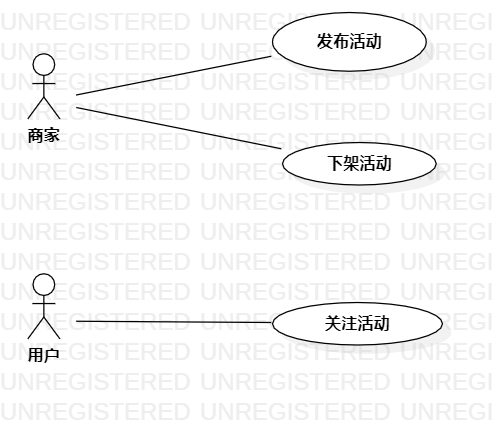

# 实验二：用例建模

## 1、实验目标 
1. 创建并完善选题
2. 根据主题用例建模
3. 提交实验文档

##2、实验内容

1. 建立个人选题项目
2. 运用UMLStar绘制用例图
3. 绘制用例规约

##3、实验步骤

### 3.1 确定选题

- 资源优惠系统

### 3.2 确定用例(User Case)
- 发布活动
- 下架活动
- 关注活动
### 3.3 确定参与者(Actor)

- 用户
- 商家

### 3.4 建立联系（Association）

## 4、实验结果

图1：资源优惠系统的用例图

## 5、 用例规约的编写
### 表1：发布活动用例规约  

用例编号  | UC01 | 备注  
-|:-|-  
用例名称  | 发布活动 |   
前置条件  |      | *可选*   
后置条件  | 进入活动列表页面 | *可选*   
基本流程  | 1.商家点击发布按钮  |*用例执行成功的步骤*    
~| 2.系统跳转到创建活动页面  |   
~| 3.商家输入活动信息，点击发布按钮   |   
~| 4.系统检查信息完整并保存信息，提示“发布成功”  |   
~| 5.系统返回到活动列表  |  
扩展流程  | 4.1 系统检查发现信息不完整，提示“信息不完整”  |*用例执行失败*    
~|    | 

### 表2：下架活动用例规约  
用例编号  | UC02 | 备注  
-|:-|-  
用例名称  | 下架活动  |   
前置条件  |   商家进入活动列表   | *可选*   
后置条件  |      | *可选*   
基本流程  | 1.商家点击活动的下架按钮  |*用例执行成功的步骤*    
~| 2.系统弹出窗口确认  |   
~| 3.商家点击确认按钮   |   
~| 4.系统查找该活动信息并删除   |   
~| 5. 系统关闭弹窗，系统显示活动列表  |  
扩展流程  | 3.1 商家点击取消按钮，系统关闭弹窗并提示“已取消下架”  |*用例执行失败*    
~|    |  

### 表3：关注活动用例规约  
用例编号  | UC03 | 备注  
-|:-|-  
用例名称  | 关注活动  |   
前置条件  |   用户进入活动列表   | *可选*   
后置条件  |      | *可选*   
基本流程  | 1.用户点击关注按钮  |*用例执行成功的步骤*    
~| 2.系统查找该活动信息  |   
~| 3.系统检查活动关注表  |   
~| 4.系统添加活动的关注用户   |   
~| 5.系统提示“关注成功”  |  
扩展流程  | 3.1 系统检测用户已存在，提示“已关注”  |*用例执行失败*    
~| 2.2   |