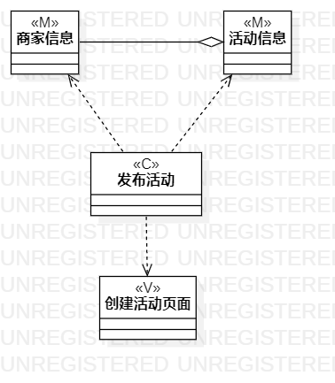
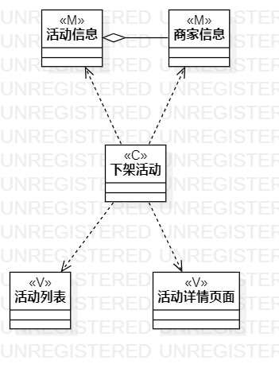

# 实验四&五

## 1、实验目标
1. 掌握类建模方法；
2. 了解MVC或你熟悉的设计模式
3. 掌握类图的画法。(Class Diagram)

## 2、实验内容
1. 基于MVC模式设计类
2. 设计类之间的关系
3. 画出类图

## 3、实验步骤
1. 根据用例分析MVC

	Model：数据、实体、模型

	View：视图、界面、UI

	Controller：控制器、服务
2. 了解类关系 Class Relationships
3. 设计类
4. 完善类之间关系

## 4、实验结果

图1：发布活动类图

图2：下架活动类图

图3：关注活动类图