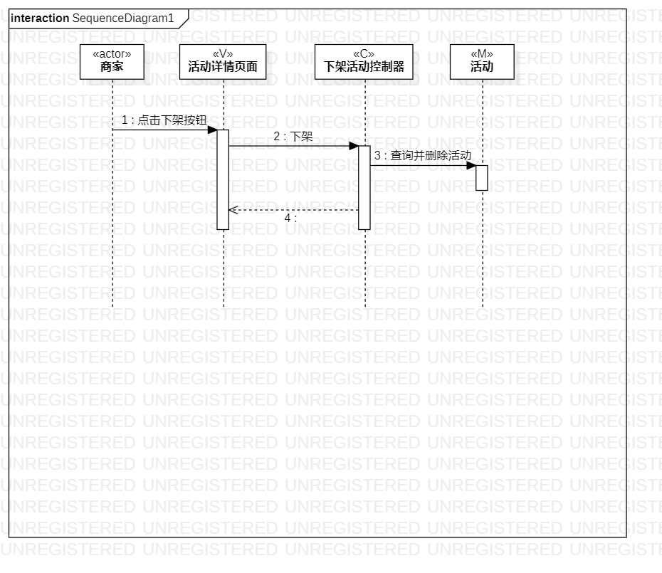
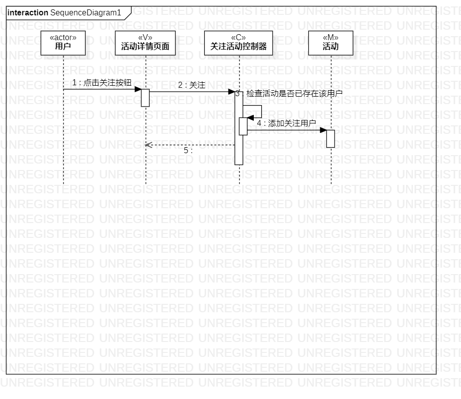

# 实验六

## 实验目标
1. 理解系统交互；
2. 掌握UML顺序图的画法；
3. 掌握对象交互的定义与建模方法。

##实验内容
1. 根据用例模型和类模型，确定功能所涉及的系统对象；
2. 在顺序图上画出参与者（对象）；
3. 在顺序图上画出消息（交互）。

##实验步骤

1. 创建顺序图
2. 创造参与者（actor）
3. 创造MVC模型
4. 根据类图和活动图画出消息（Message） 

##实验结果

图1：发布活动顺序图

图2：下架活动顺序图

图3：关注活动顺序图