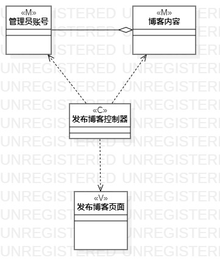
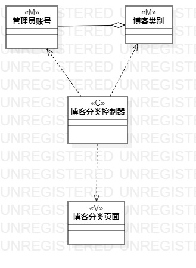

# 实验四五：类建模

## 一、实验目标
1. 掌握类建模方法
2. 了解MVC设计模式
3. 掌握类图的画法

## 二、实验内容
1. 观看类图视频讲解
2. 根据用例规约画出类图
3. 编写实验报告

## 三、实验步骤
1. 打开StarUML,创建发布博客的类图
2. 添加Model:管理员、博客内容，View：博客发布页面，Control:博客发布控制器
3. 创建设置博客所属类别的类图
4. 添加Model:管理员、博客类别，博客内容，View：设置博客所属类别页面，Control:设置博客所属类别控制器

## 四、实验结果

图1 发布博客的类图

图2 设置博客所属类别的类图

## 五、实验心得
本次实验掌握了类图的画法，了解MVC的设计模式，包括Model、View、Control.

## 六、课堂笔记
1. 用例图讲的是 what to do
2. 活动图讲的是 how to do
3. 类图讲的是 who do
4. 依赖是一种最弱的关联，继承是最强的关联
