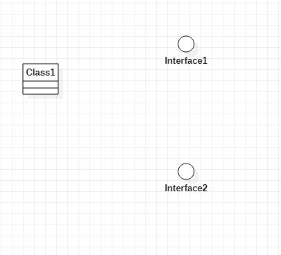

# 实验一

## 一、 实验目标
1. 熟悉GitHub实验过程
2. 安装与使用StarUML

## 二、实验内容
1. 安装GitHub
2. 安装StarUML并创建第一个图
3. 编写实验报告文档

## 三、实验步骤
1. 下载git工具和StarUML软件
2. 在Github上面主库fork项目后，clone到本地磁盘
3. 使用StarUML建立一个UML图并导出
4. 用git工具上传
5. 在Github上面使用Markdown编辑器编写Lab1文档，插入导出的UML图片
6. 在个人的库中pull request，请求把编写的文档合并到主库中

## 四、实验结果
1. 画图

图1. 在StarUML上创建的第一个图
