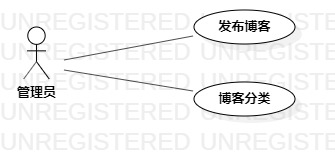

# 实验二：用例图画图

## 一、实验目标
- 了解用例图中的Actor和Use Case
- 学会根据自己的题目画出用例图
- 学会编写用例规约

## 二、实验内容
- 创建UML图
- 编写用例规约
- 编写实验报告文档

## 三、实验步骤
1. 选题为Blog博客系统
2. 在StarUML中根据选题画出用例图
3. 确定Actor ：管理员
4. 确定UseCase： 发布博客、博客分类
5. 建立Actor和UseCase的联系
6. 编写用例规约

## 四、实验结果

图1 实验二用例图

## 表1：发布博客用例规约  

用例编号  | UC01 | 备注  
-|:-|-  
用例名称  | 发布博客  |   
前置条件  | 管理员登录博客系统成功；      | *可选*   
后置条件  |      | *可选*   
基本流程  | 1. 管理员点击发布博客按钮；  |*用例执行成功的步骤*    
~| 2. 系统显示博客发布页面；  |   
~| 3. 管理员添加博客内容，点击发布； |   
~| 4. 系统检测到博客内容不为空，保存博客内容；  |   
~| 5. 系统提示“博客发布成功！”  |  
扩展流程  | 4.1 系统检测到博客内容为空，提示“博客内容不能为空！”  |*用例执行失败*  

## 表2：博客分类用例规约  

用例编号  | UC02 | 备注  
-|:-|-  
用例名称  | 博客分类  |   
前置条件  | 管理员登录博客系统成功；      | *可选*   
后置条件  |     | *可选*   
基本流程  | 1. 管理员点击博客分类按钮；  |*用例执行成功的步骤*    
~| 2. 系统显示博客分类页面；  |   
~| 3. 管理员按类别分类博客； |   
~| 4. 系统检测到博客类别存在，保存分类记录；  |   
~| 5. 系统提示“博客分类成功！”  |  
扩展流程  | 4.1 系统检测到博客类别不存在，提示“博客类别不存在！”  |*用例执行失败*  

