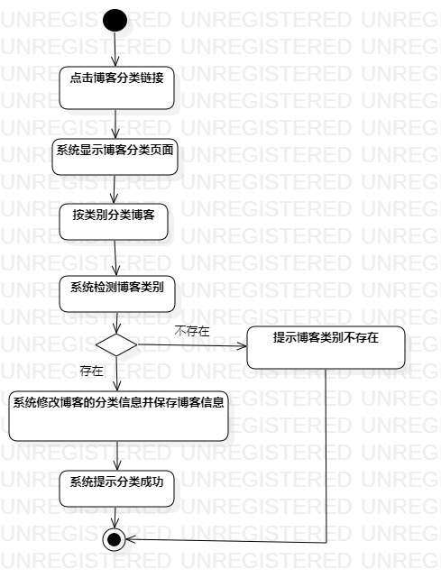

# 实验三：过程建模
## 一、实验目标
1. 掌握过程建模的方法
2. 掌握活动图的画法（Activity Diagram）
## 二、实验内容
使用StarUML根据实验二的用例规约画出相应的活动图
## 三、实验步骤
1. 观看教学视频讲解
2. 根据用例规约创建活动图
3. 创建“博客发布”活动图
- 添加Atcion,说明操作
- 添加decision，根据判断跳转
4. 创建“设置博客所属类别”活动图
- 添加Atcion,说明操作
- 添加decision，根据判断跳转
5. 导出活动图(.jpg)
6. 编写实验报告
## 四、实验结果

图1. 博客发布的活动图

图2. 设置博客所属类别的活动图

## 五、实验心得
本次实验掌握了根据用例规约画出相应的活动图，掌握了过程建模的方法。
