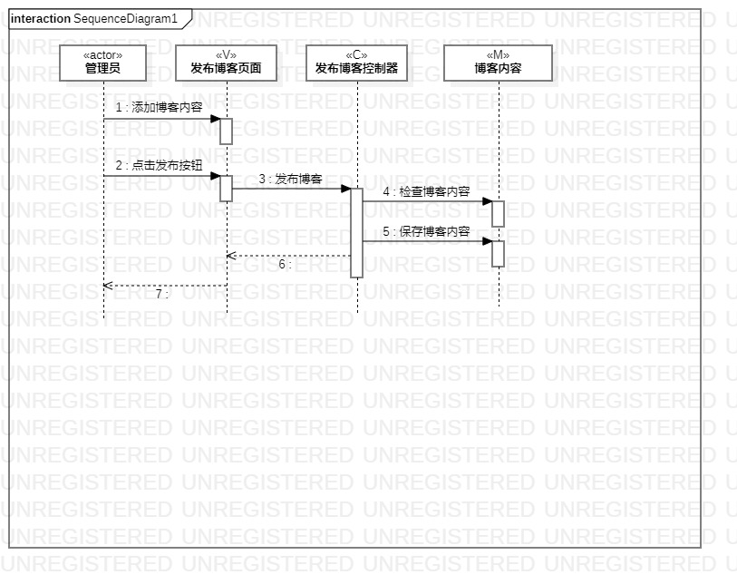
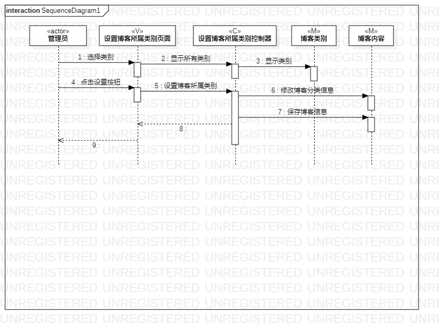

# 实验六：交互建模
## 一、实验目标
1. 理解系统交互；
2. 掌握UML中顺序图的画法；
3. 掌握对象交互的定义和建模方法。
## 二、实验内容
1. 根据用例模型和类模型，确定功能所涉及的系统对象；
2. 在顺序图上画出参与者（对象）；
3. 在顺序图上画出消息（交互）。
## 三、实验步骤
1. 创建“发布博客”的顺序图
2. 添加对象并画出对象之间的交互；
3. 创建“设置博客所属类别”的顺序图；
4. 添加对象并画出对象之间的交互；
5. 导出顺序图（.jpg）；
6. 编写实验报告。
## 四、实验结果

图1 发布博客的顺序图

图2 设置博客所属类别的顺序图

## 五、实验心得
本次实验理解了系统的交互，学会根据自己项目的用例图、用例规约、活动图等画出相应的顺序图，掌握了顺序图的画法。

