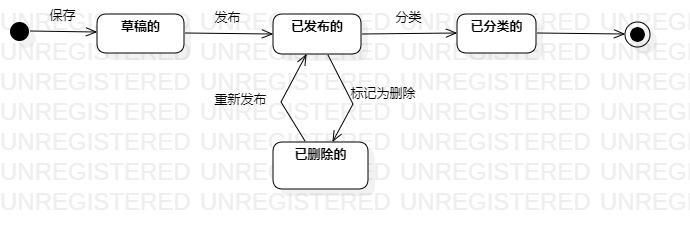

# 实验七：状态建模
## 一、实验目标
掌握对象状态建模（状态图，Statechart）。
## 二、实验内容
1. 观看状态图讲解及演示画法；
2. 根据自己的用例画出状态图；
3. 导出状态图(.jpg)；
4. 编写实验文档。
## 三、实验步骤
1. 创建状态图；
2. 选择自己项目一个最重要的对象；
3. 画出对象的状态及转换条件；
## 四、实验结果

图1 博客的状态图

## 五、实验心得
本次实验掌握了状态图的概念和画法，学会根据自己的项目选择一个最重要的对象，画出对象的状态图。
