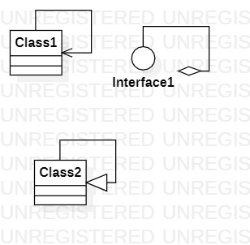

# 实验一：UML建模工具

## 一、实验目标

1. 下载安装建模工具StarUMl，了解软件基本使用
2. 确定个人建模选题
3. 掌握Git工具和平台GitHub的使用

## 二、实验内容

1. 安装UMl建模工具
2. 加入学习课程库hzuapps/uml-modeling-2020
3. 安装Git工具并了解基本使用

## 三、实验步骤

1. 加入课程学习库hzuapps/uml-modeling-2020
2. Fork实验库到个人账号下
3. 安装Git工具
4. 克隆代码到本地仓库
5. 使用建模工具StarUML完成第一张建模图(no1.jpg)
6. 撰写实验一实验报告

## 四、实验结果

图一：第一张建模图