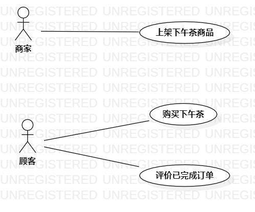

# 实验二：用例建模

## 一、实验目标
1. 掌握使用Markdown编写实验报告
2. 掌握使用StarUml画用例建模图
3. 学会写用例规范

## 二、实验内容
1. 确定选题
2. 根据选题的功能，画出用例建模图
3. 使用Markdown完成实验报告

## 三、实验步骤
1. 确定选题“下午茶订购系统”（#767），功能如下：
- 上架下午茶商品
- 购买下午茶
- 评价已完成订单
2. 根据功能，确定两个参与者
- 商家
- 顾客
3. 根据功能，确定三个用例
- 上架下午茶商品
- 购买下午茶
- 评价已完成订单
4. 根据参与者与用例之间的关系，连线确定它们之间的联系，完成用例建模图
5. 写出三个用例的用例规范（UC01、UC02、UC03）

## 四、实验结果

图一：下午茶订购系统用例图

## 表1：上架下午茶商品用例规约  

用例编号  | UC01 | 备注  
-|:-|-  
用例名称  | 上架下午茶商品  |   
前置条件  | 商家已登录商家账号系统      | *可选*   
后置条件  | 系统显示下午茶商品选购页面     | *可选*   
基本流程  | 1. 商家点击“上架”按钮  |*用例执行成功的步骤*    
~| 2. 系统显示上架页面  |   
~| 3. 商家输入下午茶名称、详细介绍、库存数量，上传商品图片   |   
~| 4. 系统查询下午茶名称，检查下午茶没有上架过，保存下午茶全部信息   |
~| 5. 系统显示上架成功页面，提示“上架成功”   |
扩展流程  | 4.1 系统检查下午茶名称已经上架过，提示“已上架”   |*用例执行失败*    

## 表2：购买下午茶用例规约  

用例编号  | UC02 | 备注  
-|:-|-  
用例名称  | 购买下午茶  |   
前置条件  | 顾客已登录顾客账号系统      | *可选*   
后置条件  |      | *可选*   
基本流程  | 1. 顾客点击下午茶商品图片  |*用例执行成功的步骤*    
~| 2. 系统显示下单页面  |   
~| 3. 顾客输入购买数量，点击“购买”按钮   |
~| 4. 系统生成订单，保存订单信息   |
~| 5. 系统查询下午茶库存充足   |
~| 6. 系统显示支付页面   |
~| 7. 顾客点击“支付”按钮   |
~| 8. 系统查询顾客账户余额，并更新账户余额和下午茶库存   |
~| 9. 系统提示“付款成功”   |
扩展流程  | 5.1 系统查询下午茶库存不足下单数量，提示“商品不足”，返回下单页面   |*用例执行失败* 
~| 8.1 系统查询账户余额不足，提示“支付失败”     | 

## 表3：评价已完成订单用例规约  

用例编号  | UC03 | 备注  
-|:-|-  
用例名称  | 评价已完成订单  |   
前置条件  | 顾客进入订单列表页面      | *可选*   
后置条件  |      | *可选*   
基本流程  | 1. 顾客点击“评价”按钮  |*用例执行成功的步骤*    
~| 2. 系统显示评价页面  |   
~| 3. 顾客星级评价下午茶商品和配送服务，点击“评价”按钮  |
~| 4. 系统检查星级评价不为空  |
~| 5. 系统保存评价信息   |
~| 6. 系统更新订单信息（更新评价内容）   |
~| 7. 系统显示评价成功页面，提示“评价成功”   |
扩展流程  | 4.1 系统检查星级评价为空，提示“评价失败”   |*用例执行失败*
