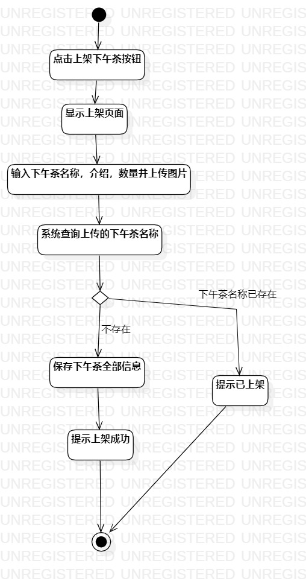
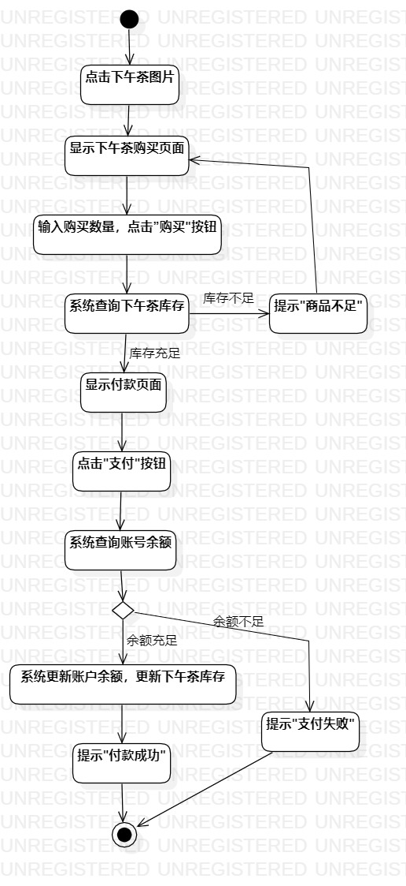
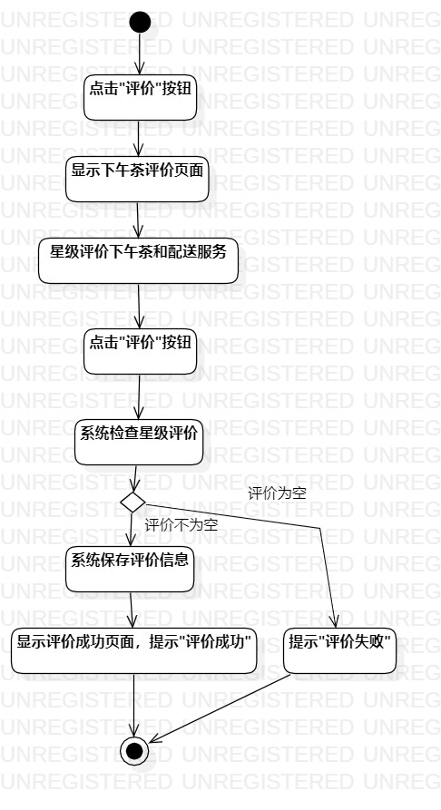

# 实验三：过程建模
## 一、实验目标
1. 掌握过程建模方法
2. 掌握活动图画法以及一些注意细则

## 二、实验内容
1. 利用过程建模方法，根据实验二用例规约画出活动图
2. 编写实验三实验报告

## 三、实验步骤
1. 修改完善实验二报告（Lab2.md）“评价已完成订单”用例规约
2. 画活动图
- 添加开始结点（Initial）和结束结点（Final）
- 添加多个动作（Action）确定活动图主线
- 添加判断条件（Merge）和判断条件确定活动图分支
- 连线并调整
3. 编写实验三实验报告

## 四、实验结果

图一：上架下午茶活动图

图二：订购下午茶活动图

图三：评价已完成订单活动图
