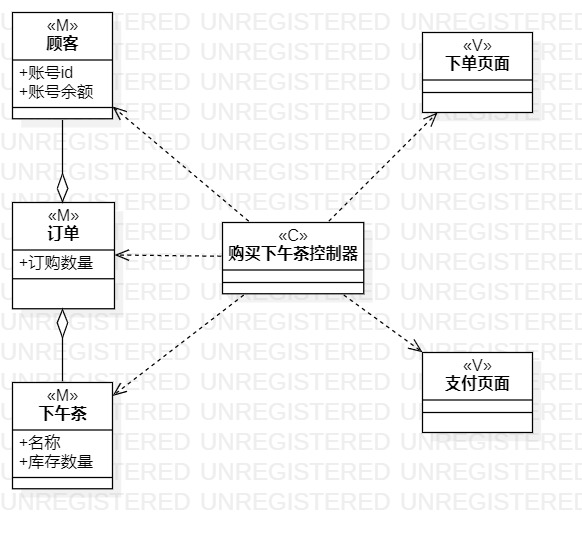
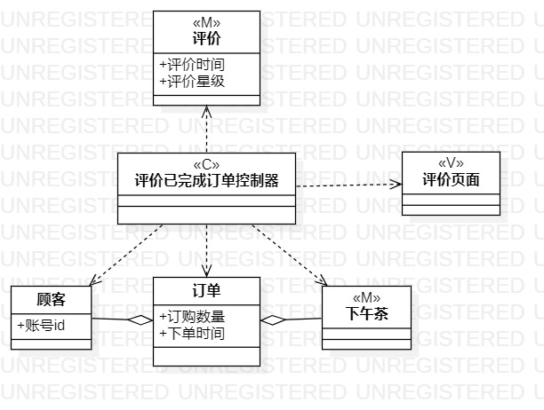

# 实验四/五：类建模和高级类建模

## 一、实验目标
1. 掌握类的概念
2. 掌握类建模的方法，学会根据用例规约画类图
3. 了解并使用MVC设计模式
4. 理解类的5种关系，掌握类之间关系的画法

## 二、实验内容
1. 根据用例规约设计类
2. 确定类之间的关系
3. 基于MVC设计模式设计类图

## 三、实验步骤
1. 根据用例规约确定类
2. 根据MVC设计模式将类逐个定义M,V,C
3. 确定类与类之间的关系并连线
4. 将类图导出并上传GitHub
5. 撰写实验四/五实验报告

## 四、课堂笔记
1. 类的概念
- 一种具体的，抽象的数据类型
- 不能用简单的数据类型直接表示
2. 类之间的5中关系
- Dependency(依赖)
- Association(关联)
- Aggregation(聚合)
- Composition(组合)
- Inheritance(继承)
从上往下类与类之间的关系逐渐从强到弱
3. MVC设计模式
- MVC设计模式分3层：模型层(M),界面层(V)，控制层(C)
- MVC设计模式的通信：模型层与界面层不能进行通信，控制层与模型层和界面层均可以进行通信
4. 类图设计中注意的事项
- 分清什么是普通的数据类型和类，要认真从用例规约中确定出必不可少的类
- 类图中不能出现两个一样的类（特殊情况下可以是类本身进行Aggregation）
- 设计类图中控制器，界面等字眼不能缺少

## 五、实验结果

图一：上架下午茶类图

图二：订购下午茶类图

图三：评价已完成订单类图
