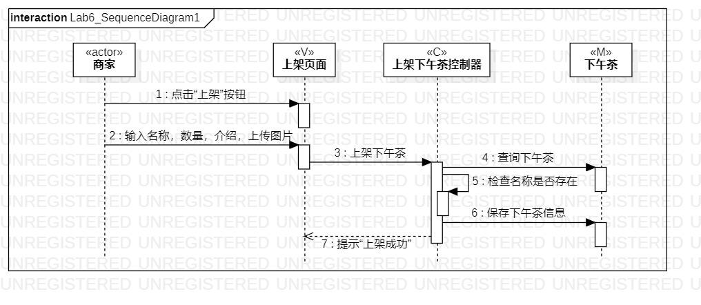
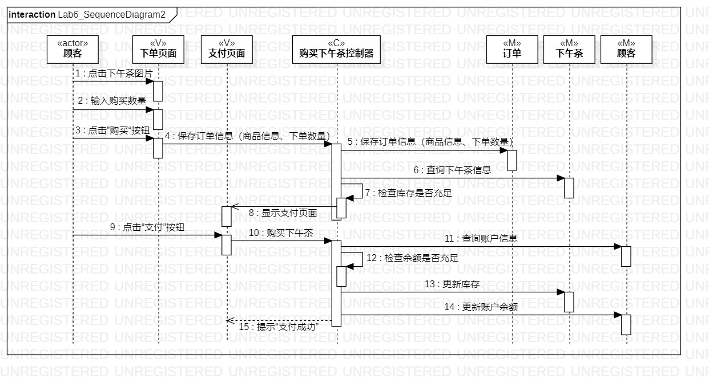
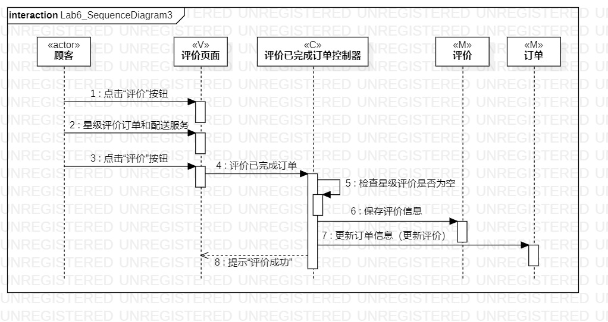

# 实验六：交互建模

## 一、实验目标

1. 理解交互建模
2. 理解顺序的构成、顺序图的“时间顺序”、消息以及存活条的概念
3. 掌握交互建模的方法以及学习画顺序图

## 二、实验内容

1. 根据用例图和类图，确定顺序图中的系统对象（参与者、类）
2. 学习顺序图的画法，在顺序图中画出信息交互

## 三、实验步骤

1. 完善实验二用例规约，修改实验三三个活动图，修改实验四类图3：评价已完成订单
2. 画顺序图
- 从用例图中确定参与者（actor）
- 从类图中确定N个参与者（M,C,V）
- 根据用例规约画出顺序图中的信息交互
3. 完成实验六实验报告

## 四、课堂笔记

1. 对象的概念与类的区别
- 类是概念的
- 对象是真真实实存在的，既存在于现实世界，也保存至计算机系统
2. 顺序图的概念
- 时间仅表示先后顺序，不表示时间跨度，垂直方向位置与时间跨度无关
- 时间图才可表示时间跨度
- 事件表示的是交互的时候发生的时间点
- 事件=消息=信号
- 存活条显示了发送端和接收端，注：所有的消息都要画在存活条上
3. 顺序图的画法
- 确定1个参与者（用例图）——确定N个参与者——画出信息交互（用例规约）

## 五、实验结果

图一：上架下午茶顺序图

图二：订购下午茶顺序图

图三：评价已完成订单顺序图
