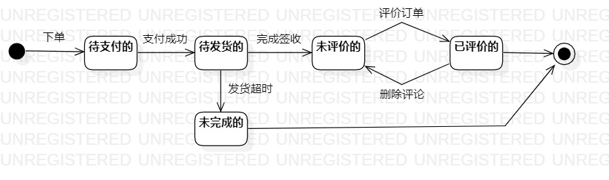

# 实验七：状态建模

## 一、实验目标

1. 掌握对象状态建模

## 二、实验内容

1. 理解对象状态的概念
2. 认识状态图的构成要素(状态、转变)
3. 掌握状态图的画法

## 三、实验步骤

1. 学习状态图构成
2. 画状态图
- 根据类图和顺序图确定关键对象(订单)
- 根据对象确定对象状态(待支付的、待发货的、未评价的、已评价的)
- 写入状态之间的转变(下单、支付成功、签收、评价订单、删除评价)
3. 撰写实验七实验报告

## 四、课堂笔记

1. 状态图的构成
- 状态：对象的一个状态，取决于对象所包含的所有数据（形容词)
- 转变：不同于转变条件，转变条件需要添加括号
2. 画状态图注意事项
- 不画不存在的状态
- 区分两个状态是否是一致的
- 转变条件不能直接当成转变来操作，需加入方括号

## 五、实验结果

图一：订单状态图