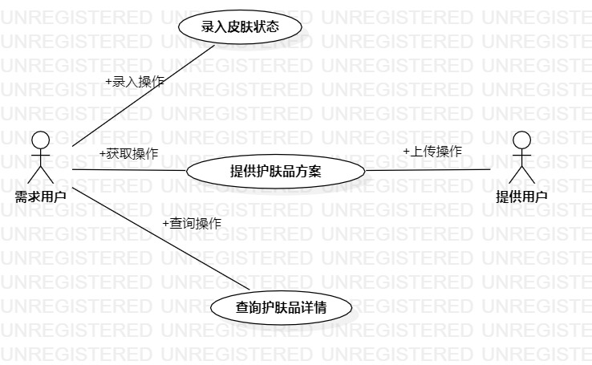
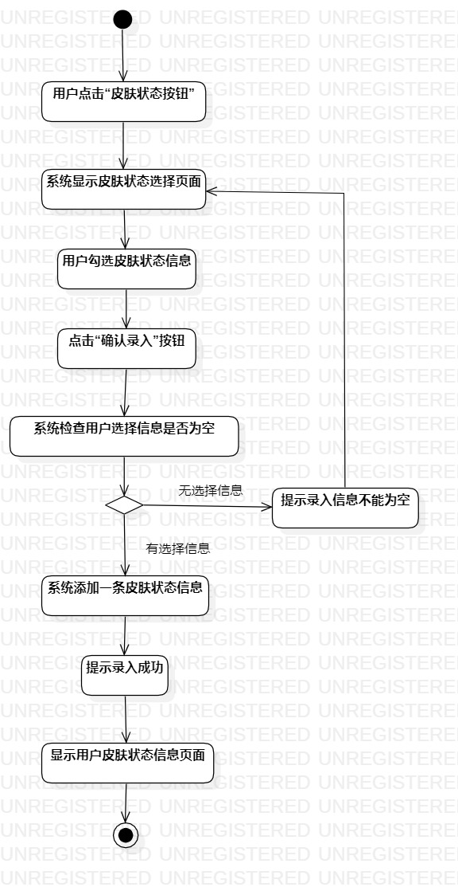
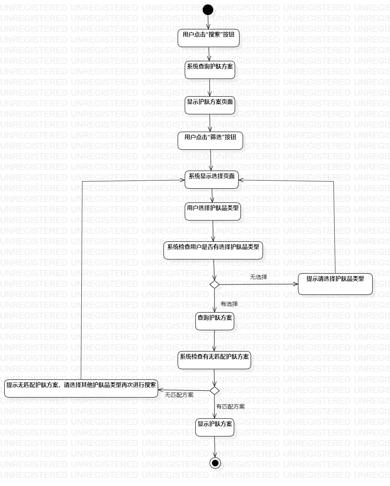
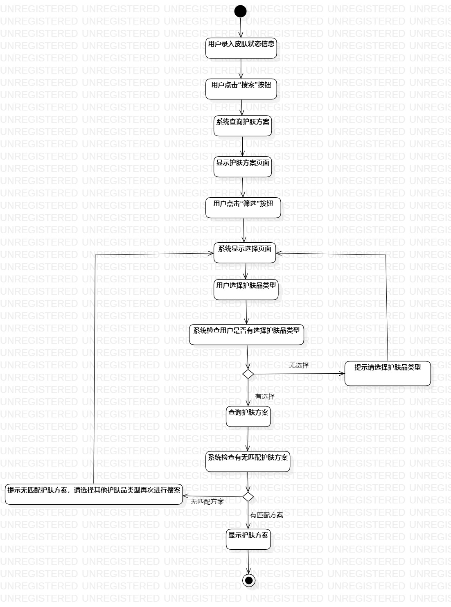

# 实验三：过程建模

## 一、实验目标

1.选题过程建模

2.掌握过程建模方法

3.掌握活动图的画法

## 二、实验内容

1.根据选题进行过程建模

2.根据用例规约画活动图

3.完成实验报告

## 三、实验步骤

1.确认选题 - 护肤品推荐系统

2.根据选题创建用例图

  * a.确认系统的参与者 - 用户
  
  * b.确认系统的功能 - 录入皮肤状态、查询护肤品详细、查询护肤方案

  * c.建立用户和功能的关系 - 用例图

3.根据用例图中功能攥写3个用例规约

  * 功能a.录入皮肤状态
  
  * 功能b.查询护肤品详细
  
  * 功能c.查询护肤方案

  细化每个功能的业务流程，根据系统需求适当增加扩展流程

4.将用例规约中每个功能的业务流程转换为活动图

  * a.参考演示视频画图
  
  * b.根据实验问题讲解视频修改活动图中可能存在的问题
  
  * c.将用例规约中的基本流程化成活动图

## 四、实验结果

1. 用例图

图1：实验二用例图

2. 用例规约

* 表1：录入皮肤状态用例规约  

用例编号  | UC01 | 备注  
-|:-|-  
用例名称  | 录入皮肤状态  |   
前置条件  | 用户登录护肤品推荐系统 |
后置条件  |      |  
基本流程  | 1.用户点击“皮肤状态”按钮|*用例执行成功的步骤*    
~| 2.系统显示选择页面 |
~| 3.用户点击勾选皮肤状态信息，点击“确认录入”按钮 |   
~| 4.系统添加一条皮肤状态信息，提示“录入成功”， |   
~| 5.用户点击“关闭”按钮 |
~| 6.系统返回首页，显示皮肤状态信息 |
扩展流程  | 3.1 系统检查用户选择操作为空，提示“录入信息不能为空”  |*用例执行失败*    

* 表2：查询护肤方案用例规约  

用例编号  | UC02 | 备注  
-|:-|-  
用例名称  | 查询护肤方案  |   
前置条件  | 用户已成功录入皮肤状态 |
后置条件  |      |
基本流程  | 1.用户点击“搜索”按钮  |*用例执行成功的步骤*    
~| 2.系统查询护肤方案 |   
~| 3.系统显示护肤方案页面 |   
~| 4.用户点击“筛选”按钮 |   
~| 5.系统显示护肤品类型选择页面 | 
~| 6.用户选择护肤品类型 |
~| 7.系统检查用户选择操作不为空，查询护肤方案 |
~| 8.系统显示护肤方案 |
扩展流程  | 7.1 系统检查用户选择操作为空，提示“请选择护肤品类型”   |*用例执行失败*  
~| 8.1 系统检查无匹配护肤方案，提示“无匹配护肤方案，请选择其他护肤品类型再次进行搜索”   |

* 表3：查询护肤品详情用例规约  

用例编号  | UC03 | 备注  
-|:-|-  
用例名称  | 查询护肤品详情 |   
前置条件  | 用户登录护肤品推荐系统 | 
后置条件  |      | 
基本流程  | 1.用户在输入框输入护肤品名称，点击“搜索”按钮 |*用例执行成功的步骤*    
~| 2.系统查询护肤品信息 |   
~| 3.系统显示护肤品详细信息 | 
扩展流程  | 2.1 系统检查输入信息为空，提示“请输入护肤品名称”  |*用例执行失败*
~| 2.2 系统检查输入信息不为空，查询不到护肤品信息，提示“无此护肤品，请检查输入名称是否错误”  |

3. 活动图

* 1) 录入皮肤中状态

  
  
  图2：实验三活动图_1
  
* 2) 查询护肤品详情

  
  
  图3：实验三活动图_2
  
* 3) 查询护肤方案

  
  
  图4：实验三活动图_3
