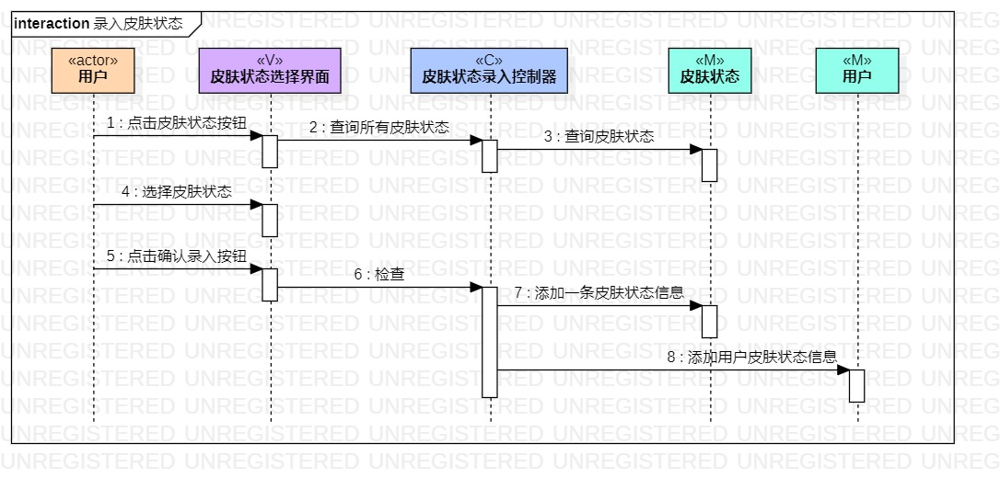
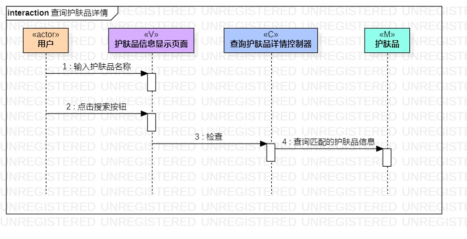
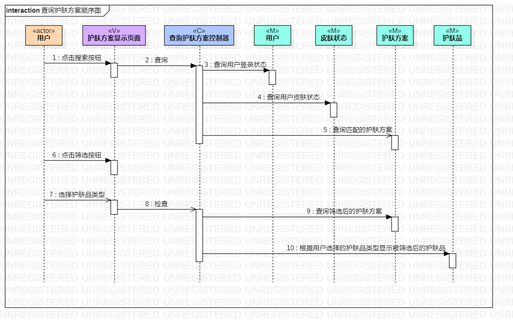

# 实验六：类建模

## 一、实验目标

1.理解系统交互

2.掌握UML顺序图的画法

3.掌握对象交互的定义与建模方法

## 二、实验内容

1.根据用例模型和类模型，确定功能所涉及的系统对象

2.在顺序图上画出参与者（对象）

3.在顺序图上画出消息（交互）

## 三、实验步骤

1.确认选题 - 护肤品推荐系统

2.根据选题创建用例图

3.根据用例图中功能攥写用例规约

4.将用例规约中每个功能的业务流程转换为活动图

5.将用例规约中存在的类提取出来画为类图

6.根据用例图、用例规约、活动图、类图画顺序图

*a.看视频学习交互建模的概念

*b.学习对象、类和参与者的概念，掌握对象、类和参与者的画法

*c.理解交互发生的顺序、交互发生的时间点以及存活条的概念

*d.看顺序图画图操作演示，从用例图中找出参与者，在类图中找出可能存在的参与者，根虎活动图中的操作步骤，画出参与者之间的活动交互

*e.对照顺序图示例和PR中已通过的同学的作业，查找并修改顺序图中可能存在的问题

## 四、实验结果

1.录入皮肤状态顺序图

2.查询护肤品详情顺序图

3.查询护肤方案顺序图

## 五、学习笔记

1.交互模型是用来描述系统内部的交互，是跨越了许多对象的整体行为视图。交互模型在3个不同的抽象层次上进行建模，分别是：用例模型，顺序模型，活动模型

2.类模型描述系统中的对象及其关系

3.顺序图显示了交互的参与者以及参与者之间的消息序列，也显示了系统为了执行全部或部分用例而与其参与者的交互。

4.顺序图的表示：每个参与者以及系统都用一条垂直的生命线表示。每条消息从发送方指向接收方的水平箭头表示；时间从上往下延伸（间距不相关）
