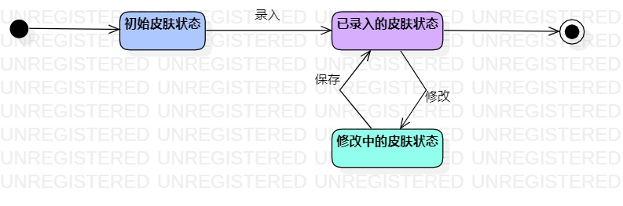

# 实验七：状态建模

## 一、实验目标

1.掌握对象状态建模（状态图，Statechart）

## 二、实验内容

1.寻找一个关键的对象

2.设计该对象的关键状态

-对象的状态是：对象所表示的数据，如果数据发生变化，状态就是发生变化

-描述状态：形容词

-皮肤状态：初始状态、已录入的、修改中的

3.设计状态之间的转变条件

4.整个状态图都是在描述一个对象

## 三、实验步骤

1.确认选题 - 护肤品推荐系统

2.根据选题创建用例图

3.根据用例图中功能攥写用例规约

4.将用例规约中每个功能的业务流程转换为活动图

5.将用例规约中存在的类提取出来画为类图

6.根据用例图、用例规约、活动图、类图画顺序图

7.在用例图、用例规约、活动图、类图、顺序图中选取一个对象画状态图

*a.观看老师演示图像、掌握画图要点

*b.确定画图对象为：皮肤状态

*c.在活动图和顺序图中提取皮肤状态的状态形容词：初始状态（用户注册登录后系统默认的皮肤状态），已录入的皮肤状态（用户自主录入的皮肤状态），修改中的皮肤状态（用户根据自己皮肤实际状态修改已录入的皮肤状态）

*d.设计状态之间的转变条件

*e.将bcd步骤提取的信息转化为图像

## 四、实验结果

1.皮肤状态-状态图

## 五、学习笔记

1.状态模型是描述响应外部激励而发生的操作序列。状态模型有多个状态图组成，每个类对应一个状态图，描述对应用程序而言的重要的时序行为。状态图用有限状态机的图形表示法，联系起事件和状态事件表示外部激励，状态表示对象的取值

2.状态是对象取值和链接的抽象。根据对象的总体行为，将取值和连接的集合组成一个状态。状态的表示方法：包括可选状态名的圆角方框，约定使用黑体在圆角方框内列出状态名

3.状态图说明了有事件序列引起的状态序列；结点是状态，有向弧是状态间的迁移。类中的所有对象都执行该类的状态图，状态图会建模对象的公共行为

4.状态图注意事项：必须有起始状态，通常有终止和取消状态；状态命名要用名词短语、动词过去时或正在进行时等具有延续性的词汇；在需求分析过程中，尽可能不涉及动作
