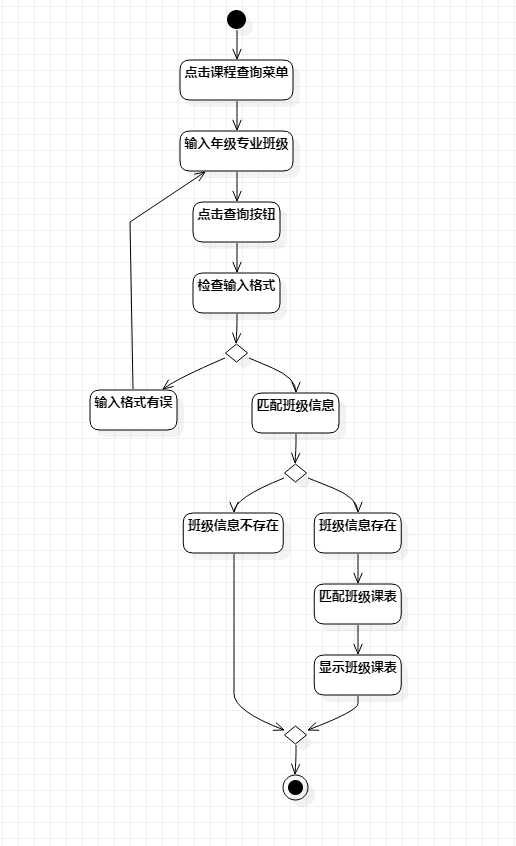

#  实验三   过程建模
 ##  一、实验目标

 1.  掌握过程建模方法
 2.  掌握活动图的画法

 ##  二、实验内容
 1.  观看实验3相关视频
 2.  用StarUML完成活动图
 3.  完成实验报告

 ##  三、实验步骤  
 1. 在StarUML创建两个活动图：  
 - 查询课表活动图
 - 修改课表活动图

 2.  根据用例规约画出活动图：  
 - 添加Initial和Final节点
 - 添加活动流程   
 - 添加决策节点  
 - 添加扩展流程
 ##  四、实验结果
  
 
 图1 查询课表活动图

 
 
  图2 修改课表活动图
